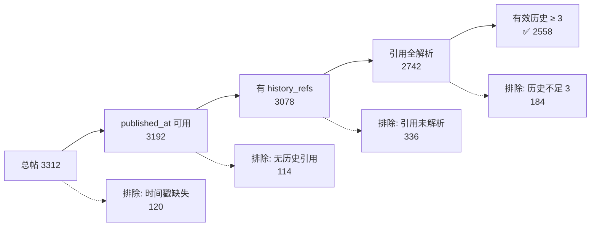
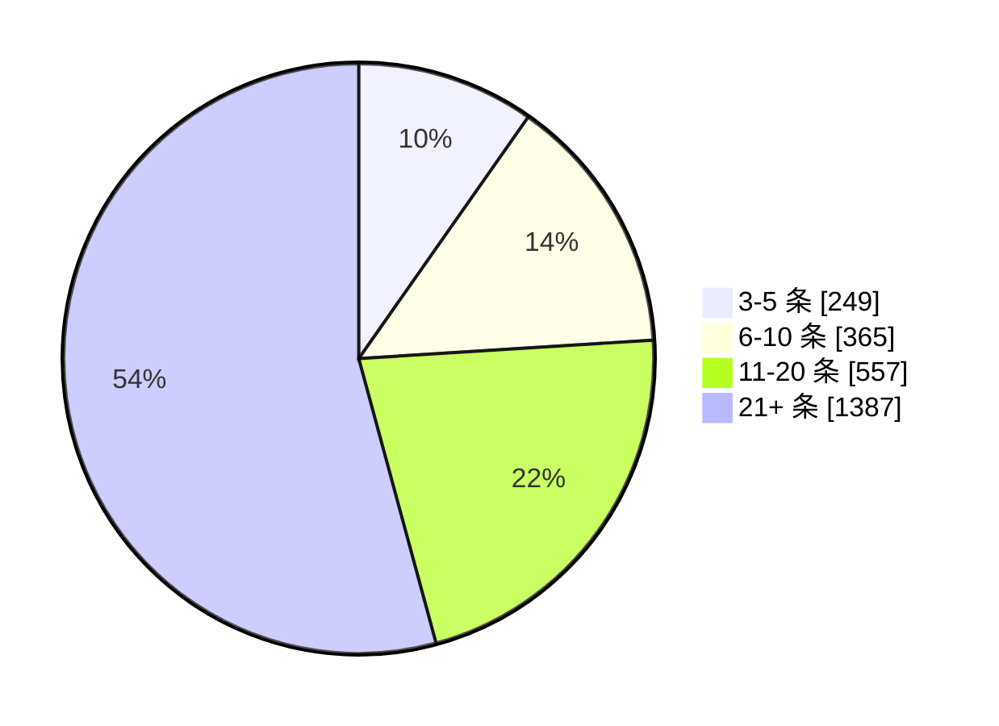

# 历史可用性聚合审计报告

> 生成时间：2026-08-09T03:27:50 UTC  
> 数据指纹：`4b14527f5266286f506130eb84e7ff162e07c33f41af60523f6148409a6f5b97`  
> 有效历史阈值：≥ 3 条

---

## 一、总览

| 指标 | 修复前 | 修复后 |
|------|:------:|:------:|
| 通过率 | **0%** | **77.2%** |
| 通过帖子 | 0 | **2558 / 3312** |
| 创作者覆盖率 | 0% | **76.1%**（89 / 117） |

> **结论**：修复后约 3/4 的帖子和创作者可纳入基线训练，cohort 规模足以支撑 CreatorShift 三类别的交叉验证。

---

## 二、各平台流水线



| 平台 | 总数 | 时间可用 | 有历史引用 | 引用全解析 | ✅ 有效历史≥3 | 通过率 |
|------|:----:|:------:|:--------:|:--------:|:-----------:|:------:|
| Bilibili | 2503 | 2390 | 2334 | 2105 | **2012** | 80.4% |
| 微信公众号 | 809 | 802 | 744 | 637 | **546** | 67.5% |
| **合计** | **3312** | **3192** | **3078** | **2742** | **2558** | **77.2%** |

---

## 三、排除原因

| 原因 | 数量 | 说明 |
|------|:----:|------|
| `published_at` 不可用 | 120 | text 中无法提取日期，需上游修复 |
| `blogger_history_refs` 为空 | 114 | 该博主仅有一帖，无更早帖子可引用 |
| 历史引用未全部解析 | 336 | 引用的历史帖缺少时间戳 |
| 有效历史不足 3 条 | 184 | 有效历史 1-2 条，不满足阈值 |
| **合计排除** | **754** | |

---

## 四、有效历史分桶分布



| 分桶 | 帖子数 | 占比 |
|------|:------:|:----:|
| 3-5 条 | 249 | 9.7% |
| 6-10 条 | 365 | 14.3% |
| 11-20 条 | 557 | 21.8% |
| **21+ 条** | **1387** | **54.2%** |

> 超过一半的通过帖拥有 21 条以上有效历史，历史数据充足。

---

## 五、平台 × 分桶交叉表

| 平台 | 3-5 条 | 6-10 条 | 11-20 条 | 21+ 条 |
|------|:------:|:------:|:--------:|:------:|
| Bilibili | 137 | 217 | 386 | **1272** |
| 微信公众号 | 112 | 148 | 171 | 115 |

- B 站以"深历史"为主（21+ 条占 63%），适合长期追踪分析
- 微信分布较均匀，21+ 条仅占 21%

---

## 六、创作者覆盖

| 指标 | 数值 |
|------|:----:|
| 至少一帖通过 | **89** |
| 无通过帖 | 28 |
| 覆盖率 | **76.1%** |

| 创作者最大有效历史 | 人数 |
|:------------------:|:----:|
| 3-5 条 | 22 |
| 6-10 条 | 16 |
| 11-20 条 | 10 |
| 21+ 条 | **41** |

> 41 位创作者拥有超过 21 条有效历史的帖子，具备充分的个人风格建模条件。

---

## 七、修复方法说明

本次修复通过 `data-tooling/repair_history_refs.py` 完成：

1. **补全时间戳**：从 `text` 正文开头提取 `YYYY年MM月DD日 HH:MM` 格式的发布时间
2. **重建历史引用**：按 `blogger_id` 分组、按 `published_at` 排序，将同一作者所有更早帖子的 `post_id` 填入 `blogger_history_refs`

```bash
# 一键修复
python data-tooling/repair_history_refs.py

# 重新审计
python data-tooling/audit_history_availability.py \
    --input data/sheets/anonymized_posts_repaired.json \
    --output data/reports/audit_repaired.json
```

---

## 八、相关文件

| 文件 | 说明 |
|------|------|
| `data/sheets/anonymized_posts_repaired.json` | 修复后的数据集 |
| `data/reports/audit_repaired.json` | 修复后审计报告（JSON） |
| `data-tooling/repair_history_refs.py` | 修复脚本 |
| `data-tooling/audit_history_availability.py` | 审计脚本 |
