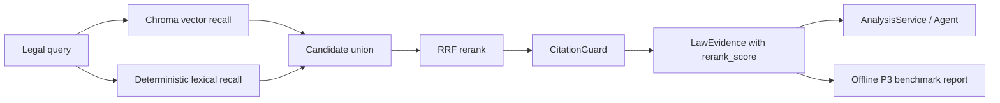
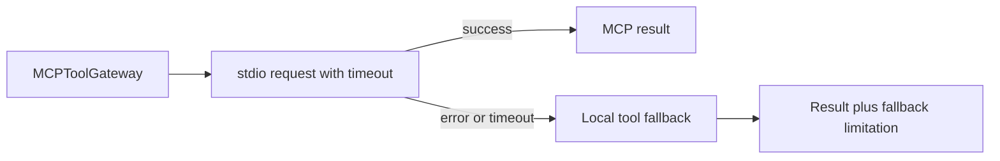

# P3 非数据依赖工程收尾设计

日期：2026-07-27

状态：待用户审查

## 1. 目标

在不依赖 M1 正式 Gold、第二人盲标、泄漏安全切分和合规审批的前提下，完成 P3 剩余的工程闭环：

- 在现有 Chroma 向量检索上增加确定性的词法召回、混合融合和重排分数。
- 让检索基准显式绑定语料与问题集，输出可复现的索引/检索评测报告。
- 为分类结果增加混淆统计和错误样本清单，但不把合成夹具结果解释为研究结论。
- 为 stdio MCP 调用增加显式超时，并验证超时后本地降级。
- 同步 HANDOFF、阶段计划表、README 和已有功能测试指令库。

完成后的准确表述是：

> P3 非数据依赖的工程范围完成；正式 M3 仍等待 M1 数据与治理条件。

## 2. 当前基线

当前分支已经具备：

- `AnalysisService` 统一分析主链。
- 基于确定性哈希嵌入的 Chroma 检索。
- `CitationGuard` 对原文引用和元数据做校验。
- 官方小型工程语料以及合成/官方检索夹具。
- 检索 Recall、MRR、引用精度、误引率、覆盖率和 P95 指标。
- 分类宏平均 F1、二分类 F1、AUROC 和 ECE 指标函数。
- MCP 调用失败后的本地工具降级。
- 运行版本、延迟和 fallback 记录。

当前全量基线为 `276 passed, 2 skipped`。两个 skip 是既有可选能力，不作为本任务新增跳过项。

## 3. 范围边界

### 3.1 本任务包含

1. 确定性混合检索与重排。
2. 显式、可复现的 P3 离线评测报告。
3. 分类误差分析报告。
4. MCP stdio 超时与本地降级。
5. 运行元数据语义校验。
6. P3 状态与测试指令文档同步。

### 3.2 本任务不包含

- 扩充或在线抓取法律/平台规则语料。
- 对法律覆盖完整性或法律意见质量作结论。
- LightRAG 接入；它只保留为未来可逆 A/B 候选。
- LLM token/cost 实测；确定性主链不伪造用量。
- 远程跨机器 MCP 部署证明。
- M1 Gold、第二人盲标、泄漏安全切分、条款补齐和隐私审批。
- P4、A2A、网页或 URL 输入链路。

## 4. 方案选择

### 4.1 检索融合

采用“现有向量召回 + 内存词法召回 + Reciprocal Rank Fusion（RRF）”。

不选择新增稀疏检索依赖或可学习 reranker，原因是当前官方语料很小，且本任务要求零网络、零密钥、确定性复现。新增模型不能在缺少正式 M1 数据时形成可信收益证明。

### 4.2 接口兼容

保持 `LegalRetriever` 协议不变。新增的混合检索器仍只暴露现有 `retrieve(query, top_k)` 行为，因此上层 `AnalysisService` 和 Agent 不需要改写。

默认 `build_default_legal_retriever()` 返回混合检索器；底层向量检索器仍可被测试和显式构造。

## 5. 详细设计

### 5.1 词法召回

新增 `impad/rag/hybrid_retriever.py`，在内存中的 `LegalDocument`/`LegalSection` 上建立轻量词法表示。

分词规则保持确定性：

- 英文和数字按小写字母数字词元切分。
- 中文使用单字和相邻双字词元。
- 删除空白词元，不依赖外部分词库。

每个 section 保存词元集合与词频。查询使用同一规则。候选分数由查询词元覆盖率与 section 词元匹配共同决定；无交集的 section 不进入词法候选。

### 5.2 候选融合与重排

向量路径和词法路径分别返回排序候选，取两者并集，使用 RRF：

```text
rrf_score(d) = Σ 1 / (60 + rank_path(d))
```

其中只对文档实际出现的路径求和。最终按以下稳定键排序：

1. RRF 分数降序。
2. 最佳单路径名次升序。
3. `document_id` 升序。
4. `section_id` 升序。

对当前候选集合中的 RRF 分数做确定性归一化，写入 `LawEvidence.rerank_score`，范围为 `[0, 1]`。保留底层向量相似度在 `similarity_score` 中，不覆盖原始语义。

输出前必须再次经过 `CitationGuard`。引用原文、标题、来源 URL、发布日期和版本元数据均来自语料 section，不由检索器生成。

### 5.3 弃答与降级

- 空查询直接返回空列表。
- 向量路径失败时继续执行词法路径。
- 词法路径失败时允许向量路径单独返回。
- 两条路径都失败或都没有有效候选时返回空列表。
- 无词法交集且向量分数低于既有最低阈值时返回空列表，避免无关查询被强制匹配。
- 混合检索器不吞掉引用校验失败；无效候选被过滤，不能以不可信引用补位。

上层运行报告继续通过 limitation/fallback 字段表达能力降级，不把缺失证据解释为反证。

### 5.4 检索基准与报告

新增显式的基准加载与报告结构，避免把合成 30 题错误地运行在官方小语料上：

- 每个 benchmark 必须声明自己的 `benchmark_version` 和期望的 `corpus_version`。
- 加载器只接受明确支持的 schema；不对未知顶层数组或对象做静默猜测。
- 语料版本不匹配时立即失败，并给出期望值和实际值。
- 合成 30 题继续绑定合成语料。
- 官方 15 题继续绑定官方小型工程语料。

报告至少包含：

- 检索器名称和版本。
- 语料版本、问题集版本和问题数。
- 索引耗时毫秒数。
- 总评测耗时和单查询 P95 毫秒数。
- Recall@1、Recall@3、MRR、引用精度、误引率、覆盖率。
- 直接题和跨文档题的分组 Recall。
- 生成时间和确定性配置。

新增 `scripts/evaluate_p3.py`，要求显式传入语料、问题集和输出路径。默认不访问网络、不读取 API key。报告以 JSON 写入用户指定路径。

### 5.5 分类误差分析

在现有分类指标之上新增报告层，不改变现有指标函数：

- 四类标签混淆计数。
- `ad` / `not_ad` 二分类混淆计数。
- 误分类样本 ID 列表。
- `review_required` 样本 ID 列表。
- 按“预测类别/真实类别”形成的稳定错误桶。
- 现有 macro-F1、binary-F1、AUROC、ECE。

`dark_ad_score` 必须来自 `ClassificationPrediction` 的显式字段，不能从 verdict confidence 反推。缺少正式 Gold 时只用测试夹具验证报告结构和计算正确性，不产生论文指标或阶段通过结论。

### 5.6 MCP 显式超时

`StdioDetectionMCPClient` 增加正数 `timeout_seconds`，默认 30 秒。每次异步请求使用 `asyncio.wait_for` 包裹。

超时行为：

1. stdio 请求抛出超时异常。
2. `MCPToolGateway` 沿用现有异常处理，转为本地工具执行。
3. 运行 limitation 中记录 `mcp_transport_fallback`。
4. 本地工具也失败时，沿用现有失败语义，不伪造工具结果。

测试通过注入可控的慢协程和极短测试超时完成，不启动真实远端服务。

### 5.7 运行元数据语义

确定性本地或 MCP 工具链没有 LLM 用量时：

- `token_usage` 保持空字典。
- `cost_usd` 保持 `null`。

不得用 `0` 假装已经接入成本采集。测试会固定这一语义，未来接入真实 LLM 后再由实际调用方填充。

## 6. 数据流



MCP 工具调用：



## 7. 预期文件变更

实现阶段预计只触及：

- `implicit-ad-agent/impad/rag/hybrid_retriever.py`
- `implicit-ad-agent/impad/rag/corpus.py`
- `implicit-ad-agent/impad/rag/evaluation.py` 或一个相邻的最小报告模块
- `implicit-ad-agent/impad/evaluation/reporting.py`
- `implicit-ad-agent/impad/orchestration/mcp_gateway.py`
- `implicit-ad-agent/scripts/evaluate_p3.py`
- 对应的 focused tests 和小型 JSON fixtures
- `README.md`
- `HANDOFF.md`
- `docs/隐性广告识别项目_分阶段计划表.md`
- 已有功能测试指令库文档

若实现中发现必须扩大该清单或改变公开协议，将暂停并重新审查设计，而不是顺手重构。

## 8. TDD 与验收

### 8.1 混合检索

先写失败测试，再实现：

- 同一查询可合并向量和词法候选。
- 排序稳定，结果写入 `rerank_score`。
- 引用仍逐字来自原始 section。
- 向量失败时词法路径可返回有效结果。
- 空查询和无关查询弃答。
- 默认官方 retriever 使用混合实现。

### 8.2 检索报告

- 合成 30 题只能与声明的合成语料运行。
- 官方 15 题只能与声明的官方语料运行。
- schema 或 corpus version 不匹配时明确失败。
- 报告包含索引耗时、P95 和全部既有指标。
- 合成基准不低于既有阈值。
- 官方基准保持既有 Recall 阈值且误引率为 0。

### 8.3 分类报告

- 固定夹具得到精确的四类与二类混淆计数。
- 错误样本和 review 样本 ID 稳定。
- 报告沿用现有分类指标。
- 不允许从 confidence 推导 `dark_ad_score`。

### 8.4 MCP 与元数据

- 超时触发本地 fallback。
- limitation 记录 `mcp_transport_fallback`。
- 非超时成功路径不回归。
- 确定性运行保持 `token_usage={}`、`cost_usd=null`。

### 8.5 回归与文档

- 运行新增 focused tests。
- 运行完整 pytest，新增测试不得引入新的 skip。
- 运行 P1 validators。
- 运行 `git diff --check`。
- 按实际命令和结果同步 HANDOFF、阶段计划表、README、已有功能测试指令库。

## 9. 完成判定

只有同时满足以下条件，才能宣布“P3 非数据依赖工程范围完成”：

1. 混合检索、报告、误差分析、MCP 超时的新增测试通过。
2. 完整测试套件通过，且无新增 skip。
3. 合成与官方检索基准均由正确语料驱动并生成报告。
4. 文档中的命令、测试数和限制与实际结果一致。
5. HANDOFF 明确写出正式 M3 仍被 M1 阻塞。

即使以上全部通过，也不能宣布正式 P3/M3 研究门禁通过。
