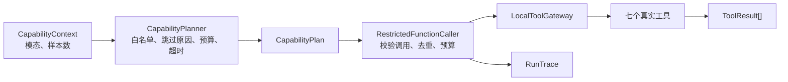

# 已有功能测试指令库

> 适用仓库：`D:\AAA Jobs\Detection-of-Recessive-Advertising`
> 适用子项目：`implicit-ad-agent`
> 当前实测基线：2026-07-30，分支 `P2_Tool-Compartment-Model-Tooling`
> P1 合并基线：P1 提交前缀 `6679671`，合并提交前缀 `98cb599`
> 目标：先安全跑通，再理解每项测试究竟证明了什么。

## 0. 先理解这份手册的三个等级

- ✅ **必跑**：完成依赖安装后不需要 API Key，不主动访问外网，不加载真实视觉模型。
- 🧪 **本地专项**：仍然零 Key、零联网，用于单独验证或学习某个模块。
- ⚠️ **显式可选**：可能下载模型、占用 GPU、调用真实 LLM、上传轨迹或产生费用。

请先完成第 1～3 节。只有这些全部通过，才说明当前本地工程基线正常。后续专项测试用于定位模块，不应该替代全量回归。

### 当前“已有功能”的准确边界

| 功能 | 当前状态 | 本手册中的验证方式 |
| --- | --- | --- |
| P1 Schema v1.0 与提交资产 | 已合并；30 条 `content_record`、30 条 supplement，含明广/暗广/非广/范围外/不确定样例 | 两套 P1 资产校验器；`tests\data` |
| P1 数据迁移与标注工具 | 已有候选迁移、隐私扫描、去重、图片处置、双人标注/一致性与 Gold 构建工具；不等于真实 Gold 数据已经完成 | `tests\data`；人工检查命令和理论章节 |
| LangGraph 证据主链 | P1/手工输入、七工具、EvidenceBundle、充分性门和保守 Judge 已接通 | Agent、图证据流与统一服务测试 |
| 七个检测工具 | 已完成统一注册、输入契约与 `ToolResult` 输出 | 七工具专项；固定样例演示 |
| Evidence、Verdict、Run 契约 | 已完成独立契约和不变量 | `tests\contracts` |
| Capability Planner、Function Calling、Tool Gateway、Trace | 已完成并接入主图 | `tests\orchestration` |
| Detection MCP 与 Gateway | 七工具 stdio 协议、主图 MCP 模式、30秒显式请求超时和失败/超时本地回落已实现 | `tests\protocols\mcp`；`tests\orchestration\test_mcp_gateway.py` |
| 法规 RAG 与 Knowledge MCP | 小规模官方语料、Chroma/hash+词法+RRF混合检索、引用守卫、版本绑定报告、Knowledge MCP 和 Judge 后报告已实现 | `tests\rag`；`tests\scripts\test_evaluate_p3.py`；Knowledge MCP/service 测试 |
| P3分类工程评测 | 三分类/暗广/校准指标、混淆计数、错误样本与复核样本清单已有合成夹具报告 | `tests\evaluation`；`scripts\evaluate_p3.py classification` |
| CreatorShift 工程准入 | 防未来泄漏HistoryView、三种池化、独立图节点、中性证据、版本化夹具基准 | `tests\creator_shift`；`scripts\evaluate_p4.py creator-shift` |
| P4校准工程框架 | 显式拒答前预测、固定种子bootstrap区间和risk-coverage报告 | `tests\evaluation`；`scripts\evaluate_p4.py calibration` |
| FastAPI 与统一服务 | 单条/批量分析、URL预览/确认、能力、run查询和兼容`/analyze`共用AnalysisService | `tests\api`；`tests\services`；`tests\adapters\platforms` |
| P5.1 URL服务边界 | HTTPS/公网目标校验、显式适配器注册、无分析预览、白名单修正审计和原子一次性确认已实现；默认无真实平台适配器 | `tests\adapters\platforms`；第4.11节 |
| CLI 演示 | `run_demo.py` 调用统一服务并持久化 run；`run_tools_demo.py` 独立演示七工具 | `tests\test_demo.py`；`tests\test_tools_demo.py` |
| 真实视觉 | YOLO/EasyOCR 路径已存在 | ⚠️ 显式 `vision_integration` |
| 真实 LLM/LangSmith | 路径已存在 | ⚠️ 人工确认 Key、端点和费用后运行 |

以下内容目前**不能**作为“已跑通功能”验收：

- 598 条历史候选记录和 6697 个历史媒体文件没有进入当前最终 P1 Git 树，不能把旧运行产物当作仓库内已交付数据；
- 双人独立标注、争议仲裁、Cohen's kappa 和最终 Gold 数据集尚未用真实数据完成；
- 远程 MCP 服务部署可达性和跨机器故障恢复；
- 当前小规模官方法规语料之外的完整法律/平台规则覆盖和法律质量；
- 真实数据上的三分类精度、最终阈值/校准、CreatorShift 增益和论文结论；P4合成夹具只能验收工程计算；
- A2A 专家间任务交换；
- 网页研究工作台、真实小红书/B站URL适配、A2A和浏览器插件；P5.1只完成通用URL服务契约。

## 1. ✅ 激活虚拟环境

以下命令从仓库根目录开始。建议整段复制到 **Windows PowerShell**：

```powershell
Set-Location -LiteralPath 'D:\AAA Jobs\Detection-of-Recessive-Advertising'
Set-ExecutionPolicy -Scope Process -ExecutionPolicy RemoteSigned
& '.\implicit-ad-agent\.venv\Scripts\Activate.ps1'
$env:PYTHONUTF8 = '1'
```

激活成功后，提示符前通常会出现 `(.venv)`。

### 1.1 验证当前 Python 确实来自项目虚拟环境

```powershell
where.exe python
python -c "import sys; print(sys.version); print(sys.executable); assert sys.prefix != sys.base_prefix"
python --version
```

通过标准：

- `where.exe python` 第一项应指向 `implicit-ad-agent\.venv\Scripts\python.exe`；
- 第二条输出同一路径，且没有 `AssertionError`；
- 当前项目要求 Python `>=3.10`；最近一次记录的实测环境为 Python `3.10.11`。

如果激活后仍然不确定解释器身份，后续命令可以把 `python` 全部替换为：

```powershell
.\implicit-ad-agent\.venv\Scripts\python.exe
```

### 1.2 PowerShell 禁止运行 `Activate.ps1`

只为当前 PowerShell 进程临时放行，然后重新激活：

```powershell
Set-ExecutionPolicy -Scope Process -ExecutionPolicy RemoteSigned
& '.\implicit-ad-agent\.venv\Scripts\Activate.ps1'
```

这不会永久修改整台电脑的执行策略。不要为了激活虚拟环境直接修改 `LocalMachine` 级策略。

### 1.3 `.venv` 不存在时

这一段是恢复环境，不属于每天必跑：

```powershell
python -m venv '.\implicit-ad-agent\.venv'
& '.\implicit-ad-agent\.venv\Scripts\Activate.ps1'
```

如果电脑上有多个 Python，先用 `py -0p` 查看版本，并明确选择 Python 3.10 或更高版本创建虚拟环境。

## 2. ✅ 安装与检查依赖

> **联网提示：** 只有本节的安装命令可能访问 Python 包索引。依赖安装完成后，第 3 节默认测试不应联网。

### 2.1 安装基础测试依赖

```powershell
Set-Location -LiteralPath 'D:\AAA Jobs\Detection-of-Recessive-Advertising\implicit-ad-agent'
python -m pip install -r requirements.txt
```

`requirements.txt` 包含 pytest 和当前 Agent/API 基础依赖。

### 2.2 安装 MCP 与 RAG 可选依赖

```powershell
python -m pip install -e ".[mcp,rag]"
```

这里的“可选依赖”是相对于最小安装而言；如果要跑通本手册中的所有本地功能测试，`mcp` 和 `chromadb` 都是需要的。

### 2.3 检查依赖是否自洽

```powershell
python -m pip check
python -c "import pytest, mcp, chromadb; print('required test dependencies: OK')"
```

当前通过输出：

```text
No broken requirements found.
required test dependencies: OK
```

`pip check` 只证明已安装包声明的版本依赖没有冲突，不证明业务功能一定正确，所以后面仍必须运行 pytest。

## 3. ✅ 必跑：一次完成本地全量验收

### 3.1 先强制关闭外部追踪并启用 UTF-8

即使你的 `.env` 曾开启 LangSmith，也要让默认测试保持本地：

```powershell
$env:LANGSMITH_TRACING = 'false'
$env:LANGCHAIN_TRACING_V2 = 'false'
$env:PYTHONUTF8 = '1'
```

`tests\conftest.py` 也会设置这两个值；这里显式设置是为了让测试意图更清楚，并保护随后手动运行的本地命令。

### 3.2 从仓库根目录验收 P1 合并和两套数据资产

```powershell
Set-Location -LiteralPath 'D:\AAA Jobs\Detection-of-Recessive-Advertising'

$p1Commit = git rev-parse 'origin/P1-·-数据地基与标注规范'
git merge-base --is-ancestor $p1Commit HEAD
if ($LASTEXITCODE -ne 0) { throw '最新 P1 没有进入当前分支' }

python scripts\data\validate_submission_assets.py
if ($LASTEXITCODE -ne 0) { throw 'P1 根目录资产校验失败' }

python data-tooling\validate_submission_assets.py
if ($LASTEXITCODE -ne 0) { throw 'data-tooling 资产校验失败' }
```

最近一次已保存的通过快照：

```text
P1 分支提交前缀：6679671
当前分支合并提交前缀：98cb599
两套校验器：VALIDATION PASSED
content records：30
supplement records：30
标签分布：明广 5 / 暗广 12 / 非广 8 / out_of_scope 3 / uncertain 2
```

两套校验器不是重复摆设：

- `scripts\data\validate_submission_assets.py` 验收 P1 根目录正式提交资产；
- `data-tooling\validate_submission_assets.py` 验收数据工具目录中的 Schema、合成样例与配套约束；
- 两者都通过，才说明合并后的两套资产没有因为路径、相对导入或目录移动而失效。

### 3.3 编译检查

```powershell
Set-Location -LiteralPath 'D:\AAA Jobs\Detection-of-Recessive-Advertising'
python -m compileall -q .\scripts\data .\data-tooling

Set-Location -LiteralPath 'D:\AAA Jobs\Detection-of-Recessive-Advertising\implicit-ad-agent'
python -m compileall -q impad tests scripts
```

通过标准：命令安静结束，退出码为 0。

它可以发现 Python 语法错误，但不能证明导入时的依赖、运行时数据或业务不变量正确。

### 3.4 全量 pytest

```powershell
python -m pytest -q
```

2026-07-30 P5.1服务工程准入后的实测快照：

```text
380 passed, 2 skipped
```

正确理解：

- `380 passed`：当前收集到的默认测试全部通过；
- `2 skipped`：两个真实 YOLO/EasyOCR 测试被有意跳过；
- 这两个 skip 是默认策略，不是缺陷；
- 只有出现 `failed` 或 `error` 才表示默认回归没有通过。

测试数量是当前快照，不是永久常量。以后新增合法测试时数字可以增加，但不能以“数量变化”为理由忽略失败。

### 3.5 最短验收命令块

以后日常开发可以直接复制这一段：

```powershell
Set-Location -LiteralPath 'D:\AAA Jobs\Detection-of-Recessive-Advertising'
& '.\implicit-ad-agent\.venv\Scripts\Activate.ps1'
$env:PYTHONUTF8 = '1'
$env:LANGSMITH_TRACING = 'false'
$env:LANGCHAIN_TRACING_V2 = 'false'

$p1Commit = git rev-parse 'origin/P1-·-数据地基与标注规范'
git merge-base --is-ancestor $p1Commit HEAD
if ($LASTEXITCODE -ne 0) { throw '最新 P1 没有进入当前分支' }
python scripts\data\validate_submission_assets.py
python data-tooling\validate_submission_assets.py

Set-Location -LiteralPath 'D:\AAA Jobs\Detection-of-Recessive-Advertising\implicit-ad-agent'
python -m pip check
python -m compileall -q impad tests scripts
python -m pytest -q
```

### 3.6 这一组测试能证明什么

- 当前分支包含合并时所指向的 P1 提交；
- P1 正式提交资产和 `data-tooling` 资产分别满足各自校验器的约束；
- 当前代码能被 Python 编译；
- 测试依赖之间没有声明级冲突；
- 默认单元、契约和本地协议测试通过；
- 默认 pytest 没有主动进入真实视觉路径；
- MCP、Chroma、CreatorShift图节点、P4夹具基准、P5.1批量/URL服务边界和选择性评估等已实现模块可以在当前虚拟环境中导入和测试。

### 3.7 这一组测试不能证明什么

- 不能证明模型在真实暗广数据上的 Precision、Recall、F1；
- 不能证明当前2份官方文档、7个sections已经形成真实、完整、最新的法规覆盖；
- 不能证明真实 LLM 端点可用或不会收费；
- 不能证明真实小红书/B站URL可以采集；默认适配器注册表为空；
- 不能证明已接通的P1 Schema→`PostRecord/CaptureStatus`主链在真实平台数据上具有研究准确率；
- 不能证明合成样例、候选数据或单人标注已经成为可用于论文结论的 Gold 数据；
- 不能证明 A2A、网页工作台或浏览器插件已经存在；
- 不能用测试通过代替论文实验中的独立数据划分、消融和统计显著性。

## 4. 🧪 按模块运行专项测试

专项测试适合三种场景：

1. 你刚修改了一个模块，希望快速反馈；
2. 全量测试失败，需要缩小范围；
3. 你正在学习源码，希望把测试和实现一一对应。

所有命令仍在 `implicit-ad-agent` 目录执行，并保持：

```powershell
$env:LANGSMITH_TRACING = 'false'
$env:LANGCHAIN_TRACING_V2 = 'false'
```

### 4.0 P1 数据迁移、图片处置与资产定位

```powershell
python -m pytest tests\data -q
```

2026-07-26 合并后已保存的实测快照：

```text
29 passed
```

这 29 个用例使用固定小 fixture，不读取历史真实候选数据，主要验证：

- 同一旧 ID 与盐值稳定映射成同一 `post_id`，不同输入不会静默碰撞；
- 旧 media、provenance、privacy 字段能迁移到目标结构；
- Schema v1.0 与 v1.1 的字段差异被明确处理；
- JSONL 可稳定读写，非法或缺关键 ID 的记录被拒绝；
- 确定性图片排版错误会被排除，旧人工决定不会被误当成新审核；
- `data-tooling` 校验器从仓库根目录定位资产，避免合并或目录移动后相对路径失效。

代码入口：

- `data-tooling\annotation\migrate_p1_candidates_to_v1.py`
- `data-tooling\annotation\apply_image_placement_disposition.py`
- `data-tooling\validate_submission_assets.py`
- `tests\data\test_migrate_p1_candidates.py`
- `tests\data\test_image_placement_disposition.py`
- `tests\data\test_data_tooling_validator.py`

当前测试不能证明：

- 598 条历史候选记录或 6697 个历史媒体文件存在于当前 Git 树；
- 迁移后的真实数据已经完成隐私复核、双人标注、争议仲裁或 Gold 构建；
- Schema v1.1 已经取代正式提交使用的 P1 Schema v1.0；
- 数据样本可以支持论文统计结论。

### 4.1 Agent 证据主链、关键词和视觉降级

```powershell
python -m pytest tests\test_smoke.py tests\test_agents.py tests\test_keywords.py tests\test_vision.py -q
```

2026-07-30 实测：

```text
11 passed
```

验证目标：

- 主图可以在零 Key 条件下完成规划、工具证据、充分性门和保守 Judge；
- Supervisor、工具组和 Judge 共用正式运行/证据契约；
- 关键词特征能产生稳定结果；
- 没有图片或没有视觉依赖时可以显式降级。

通过标准：退出码 0，没有 `failed/error`。

代码入口：

- `impad\graph.py`
- `impad\agents\supervisor.py`
- `impad\agents\nlp_agent.py`
- `impad\agents\vision_agent.py`
- `impad\agents\behavior_agent.py`
- `impad\agents\creator_shift_agent.py`
- `impad\agents\judge.py`

失败首查：

1. 是否使用 `.venv` 的 Python；
2. 两个 tracing 环境变量是否为 `false`；
3. Supervisor路由是否仍包含`creator_shift`，且该节点只产生中性证据。

当前测试不能证明：Judge阈值已校准、CreatorShift有真实增益或真实模型准确率达标。

### 4.2 七个检测工具、注册表与 VisionContext

```powershell
python -m pytest tests\test_tool_contracts.py tests\test_tool_registry.py tests\test_tool_text_intent.py tests\test_tool_sentiment.py tests\test_tool_topic_drift.py tests\test_tool_comment_anomaly.py tests\test_tool_ocr_extract.py tests\test_tool_detect_logo_product.py tests\test_tool_image_text_consistency.py tests\test_tool_vision_context.py tests\test_vision_consistency_sanity.py -q
```

2026-07-30 最新实测：

```text
40 passed
```

七个正式注册工具：

| 工具 | 必需模态 | 最低样本 | 默认超时 |
| --- | --- | ---: | ---: |
| `analyze_text_intent` | text | 1 | 10 秒 |
| `sentiment_curve` | text | 1 | 10 秒 |
| `ocr_extract` | image | 1 | 120 秒 |
| `image_text_consistency` | text + image | 各 1 | 120 秒 |
| `detect_logo_product` | image | 1 | 120 秒 |
| `topic_drift` | text + history | text 1，history 3 | 30 秒 |
| `comment_anomaly` | comments | 5 | 10 秒 |

验证目标：

- 注册表恰好暴露七个唯一、ready 的工具；
- 每个工具具有 Pydantic 输入 Schema、Function Calling 定义和 MCP 名称；
- 所有工具返回统一 `ToolResult`；
- 视觉工具拒绝远程 URL，只接受受控本地路径；
- 同一张图片可复用 `VisionContext`，避免三次 YOLO/OCR；
- 30 对图文 sanity fixture 的方向性检查稳定。

代码入口：

- `impad\tools\registry.py`
- `impad\tools\contracts.py`
- `impad\tools\vision_context.py`
- `impad\tools\text_intent.py`
- `impad\tools\sentiment.py`
- `impad\tools\topic_drift.py`
- `impad\tools\comment_anomaly.py`
- `impad\tools\ocr_extract.py`
- `impad\tools\detect_logo_product.py`
- `impad\tools\image_text_consistency.py`

失败首查：

- Registry 数量错误：检查 `TOOL_SPECS_V1` 是否出现重复或未同步元数据；
- 视觉单元测试失败：这些测试使用 synthetic/injected context，不应要求真实 YOLO；
- 历史或评论工具返回 `skipped`：先检查样本数是否达到注册表最低要求；
- `score=0`：确认这是真实观察结果，不能用 0 代替“未采集/无法运行”。

### 4.3 固定七工具演示的测试

```powershell
python -m pytest tests\test_tools_demo.py -q
```

当前实测：

```text
1 passed
```

这个测试保证脱敏固定样例能调用全部七个工具。它验证的是“演示入口和契约能协同工作”，不是模型效果评估。

代码入口：

- `run_tools_demo.py`
- `samples\tool_demo_post.json`

### 4.4 Evidence、Verdict 与 Run 契约

```powershell
python -m pytest tests\contracts -q
```

2026-07-30 最新实测：

```text
25 passed
```

验证目标：

- `EvidenceItem` 保存来源、强度、极性、生产者、版本和局限；
- `EvidenceBundle` 拒绝重复或不存在的 evidence ID 引用；
- 覆盖度、证据冲突和缺失要求可结构化表达；
- `VerdictReport` 强制标签与商业意图、披露状态一致；
- `CreatorShiftSummary`强制充分态才有数值分数，缺失/不足态不得伪造0分；
- `RunMetadata` 的耗时、费用、token、重试和降级字段满足约束。

代码入口：

- `impad\contracts\evidence.py`
- `impad\contracts\verdict.py`
- `impad\contracts\run.py`

关键不变量：

```text
明广 = commercial_intent.present + disclosure.disclosed
暗广 = commercial_intent.present + disclosure.not_disclosed
非广 = commercial_intent.absent
需复核 <=> review_required = true
```

注意：当前Judge已产出这套报告，但契约测试只规定“合法结构和语义边界”，不证明阈值、概率或研究结论正确。

### 4.5 Capability Planner、Function Calling、Tool Gateway 与 Trace

```powershell
python -m pytest tests\orchestration -q
```

2026-07-24 实测：

```text
30 passed
```

验证目标：

- Planner 根据模态和样本数决定可用/跳过工具；
- Function Calling 只能调用白名单内工具；
- 参数在执行前经过 Pydantic 校验；
- 相同工具和规范化参数的重复调用被拒绝；
- 调用次数、校验重试、单工具超时和批次总时间有硬上限；
- 工具异常被归一化为结构化 `ToolResult(status="error")`；
- Run Trace 记录 proposed、rejected、started、completed、failed、stopped；
- Trace 和 RunMetadata 必须拥有相同 `run_id`。

代码入口：

- `impad\orchestration\capability_planner.py`
- `impad\orchestration\function_calling.py`
- `impad\orchestration\tool_gateway.py`
- `impad\orchestration\tracing.py`

失败首查：

- `tool_not_allowed`：Capability Context 或 Plan 没有开放该工具；
- `invalid_arguments`：调用参数没有通过工具的 Pydantic Schema；
- `duplicate_call`：工具名与规范化参数指纹重复；
- `max_calls_reached`：调用预算用完；
- `total_time_budget_exceeded`：整批时间预算用完；
- `tool_timeout`：工具执行超过 Run/Plan/Registry 中的最小有效超时。

当前测试不能证明：未来 LLM 一定会提出正确工具调用，也不能证明远程 MCP/A2A 部署可达；它能够证明当前确定性编排已经接入 LangGraph 主图。

### 4.6 Detection MCP Server

```powershell
python -m pytest tests\protocols\mcp -q
```

2026-07-24 实测：

```text
6 passed
```

这不是只测 Python 函数。协议测试会启动真实 stdio 子进程，并验证：

- 客户端可以发现七个 `detection.*` 工具；
- 客户端可以通过 MCP 调用真实工具；
- 未知名称和非法参数被映射为受控错误；
- 相同输入经 Local Gateway 和 MCP 后，关键 `ToolResult` 字段一致。

代码入口：

- `impad\protocols\mcp\detection_server.py`
- `tests\protocols\mcp\test_detection_service.py`
- `tests\protocols\mcp\test_detection_protocol.py`

手工启动：

```powershell
python -m impad.protocols.mcp.detection_server
```

启动后终端安静等待 stdin 是正常现象，因为它是 stdio 协议服务，不是网页服务器。使用 `Ctrl+C` 停止。判断协议是否真正可用，应以前面的客户端协议测试为准。

这些测试连同 `tests\orchestration\test_mcp_gateway.py` 可以证明主图存在 `MCPToolGateway`，协议失败会按同一 ToolResult 契约回落本地并记录降级；它们不能证明远程部署在另一台机器上可达。

显式验证stdio超时与本地回落：

```powershell
python -m pytest tests\orchestration\test_mcp_gateway.py -q
```

通过标准：连接失败和内部超时都产生`mcp_transport_fallback`，本地工具仍返回统一`ToolResult`。它不证明跨机器网络、认证、重连或多用户隔离。

### 4.7 法规 RAG 混合检索与版本绑定报告

```powershell
python -m pytest tests\rag -q
```

2026-07-27 实测：

```text
26 passed
```

验证目标：

- 法规文档和条款具有版本、来源和唯一 ID；
- 合成语料必须显式标记 `fixture_only`；
- 本地 hash embedding 具有确定性、定长和归一化性质；
- Chroma 使用显式本地向量，不调用托管 embedding；
- 词法路径使用确定性词元，向量与词法候选通过RRF融合并写入`rerank_score`；
- 向量失败时可以词法降级；只有单字碰撞的无关查询不能强制命中；
- 同一文档版本重复索引具备幂等性；
- 新版本替换同一来源的旧 chunk；
- 低相关查询可以阈值拒答；
- `CitationGuard` 要求最终引用与索引原文逐字对应；
- 30 题 fixture 包含 10 题直接、10 题跨文档、10 题拒答。
- 小规模官方语料固定来源、版本、条款号和逐字引用；
- 15 题官方语料冒烟集包含直接、跨文档和拒答问题；
- benchmark显式绑定`corpus_version`，旧数组schema或版本错配会失败；
- 报告记录索引耗时、评测耗时、Recall@1/3/5、MRR、引用精度、误引率和P95；
- Knowledge MCP 只返回经过统一 LegalRetriever 和引用守卫核验的 LawEvidence。

代码入口：

- `impad\rag\contracts.py`
- `impad\rag\embeddings.py`
- `impad\rag\chroma_retriever.py`
- `impad\rag\hybrid_retriever.py`
- `impad\rag\benchmark.py`
- `impad\rag\evaluation.py`
- `tests\fixtures\legal_rag_documents.json`
- `tests\fixtures\legal_rag_eval_30.json`
- `impad\rag\data\legal_corpus_v1.json`
- `tests\fixtures\legal_rag_official_eval_15.json`

生成当前工程报告：

```powershell
python scripts\evaluate_p3.py retrieval --corpus tests\fixtures\legal_rag_documents.json --benchmark tests\fixtures\legal_rag_eval_30.json --output ..\data\reports\p3\retrieval_synthetic_30.json
python scripts\evaluate_p3.py retrieval --corpus impad\rag\data\legal_corpus_v1.json --benchmark tests\fixtures\legal_rag_official_eval_15.json --output ..\data\reports\p3\retrieval_official_15.json
```

当前报告快照：

| 指标 | 实测 |
| --- | ---: |
| 合成30题 Recall@1 / @3 / @5 | 0.75 / 1.0 / 1.0 |
| 合成30题直接 / 跨文档 Recall@5 | 1.0 / 1.0 |
| 官方15题 Recall@1 / @3 / @5 | 0.85 / 1.0 / 1.0 |
| 官方15题 MRR@5 | 1.0 |
| 两份报告无答案误引率 | 0 |

这些数值只证明当前合成检索基线达到测试门槛。官方语料冒烟集证明所收录条款可追溯和可拒答；两者都不证明法律知识完整、准确或可直接用于法律结论。

### 4.8 CreatorShift 防泄漏研究内核

```powershell
python -m pytest tests\creator_shift -q
```

2026-07-30 最新实测：

```text
27 passed
```

验证目标：

- 历史和目标时间必须带时区；
- 所有历史必须属于同一 creator；
- 历史帖子 ID 唯一且不能包含目标帖子；
- 每条历史必须严格满足 `published_at < target_time`；
- 历史按时间和帖子 ID 稳定排序；
- 目标文本缺失时返回 `unavailable`，缺失文本历史被排除；禁止把缺失内容编码为零特征；
- 历史不足时返回 `unavailable/insufficient`，禁止池化；
- mean、max、EMA 三种简单基线可复现；
- 目标与历史特征集合必须一致；
- shift 输出特征差异和排序，但不输出广告标签或校准概率。
- 独立CreatorShift图节点始终记录`sufficient/insufficient/unavailable`；
- 充分历史只写入`polarity=neutral`的历史证据；
- 加入CreatorShift历史前后，当前Judge标签、置信度、商业意图和披露结果不变；
- 版本化夹具绑定SHA-256并覆盖mean/max/EMA。

代码入口：

- `impad\creator_shift\contracts.py`
- `impad\creator_shift\baselines.py`
- `impad\creator_shift\shift.py`
- `impad\creator_shift\runtime.py`
- `impad\creator_shift\benchmark.py`
- `impad\agents\creator_shift_agent.py`

当前偏移分数：

```text
shift_score = 所有特征绝对差值的平均值
```

它是可解释的研究基线，不是“暗广概率”。测试通过也不能证明 CreatorShift 已经优于单帖多模态或简单历史池化；这需要未来真实数据上的严格对照实验。

### 4.9 P3统一服务、混合RAG、分类错误分析、MCP回落与CLI

```powershell
python -m pytest tests\rag tests\evaluation `
  tests\orchestration\test_mcp_gateway.py `
  tests\services\test_analysis_service.py `
  tests\scripts\test_evaluate_p3.py -q
```

2026-07-27 实测：

```text
45 passed
```

该组测试证明：

- CLI 与版本化 API 共用 `AnalysisService`；
- local/MCP 主图保持同一工具结果契约，协议失败会本地回落；
- Knowledge MCP、官方法规冒烟语料、Judge 后引用和报告链可运行；
- run 可持久化并按 `run_id` 查询；
- 三分类、暗广排序/校准、覆盖率、混淆计数和错误桶可以离线计算；
- 检索与分类CLI可直接按脚本路径生成JSON报告；
- 无LLM调用时`token_usage={}`且`cost_usd=null`，不会伪造成本值。

分类夹具报告：

```powershell
python scripts\evaluate_p3.py classification --predictions tests\fixtures\classification_eval_v1.json --output ..\data\reports\p3\classification_fixture.json
```

它不证明远程 MCP 服务可达、完整法规覆盖、真实分类精度或 M1 已通过。

### 4.10 P4工程准入、版本化基准与选择性评估

聚焦回归：

```powershell
python -m pytest tests\creator_shift tests\evaluation `
  tests\scripts\test_evaluate_p4.py `
  tests\test_graph_evidence_flow.py `
  tests\services\test_analysis_service.py -q
```

2026-07-30 实测：

```text
61 passed
```

重新生成两份零Key、零网络报告：

```powershell
python scripts\evaluate_p4.py creator-shift `
  --fixture tests\fixtures\creator_shift_eval_v1.json `
  --output ..\data\reports\p4\creator_shift_fixture.json

python scripts\evaluate_p4.py calibration `
  --predictions tests\fixtures\calibration_eval_v1.json `
  --output ..\data\reports\p4\calibration_fixture.json `
  --bootstrap-resamples 500 `
  --bootstrap-seed 20260730
```

检查报告契约和安全边界：

```powershell
$creator = Get-Content -Raw -Encoding UTF8 `
  ..\data\reports\p4\creator_shift_fixture.json | ConvertFrom-Json
$calibration = Get-Content -Raw -Encoding UTF8 `
  ..\data\reports\p4\calibration_fixture.json | ConvertFrom-Json

if ($creator.benchmark_version -ne 'synthetic-creator-shift-v1') {
  throw 'CreatorShift报告版本错误'
}
if ($creator.fixture_sha256.Length -ne 64) {
  throw 'CreatorShift夹具哈希错误'
}
if ((Compare-Object @('mean', 'max', 'ema') @($creator.methods)).Count -ne 0 -or `
    $creator.case_count -ne 4 -or $creator.cases.Count -ne 12) {
  throw 'CreatorShift方法或案例数量错误'
}
if (@($creator.cases | Where-Object {
      $_.status -ne 'sufficient' -and $null -ne $_.shift_score
    }).Count -ne 0) {
  throw '缺失态被错误写成数值分数'
}
if ($calibration.bootstrap_resamples -ne 500 -or `
    $calibration.bootstrap_seed -ne 20260730 -or `
    $calibration.risk_coverage[-1].coverage -ne 1.0) {
  throw '校准报告配置或coverage错误'
}
for ($i = 1; $i -lt $calibration.risk_coverage.Count; $i++) {
  if ($calibration.risk_coverage[$i].coverage -le `
      $calibration.risk_coverage[$i - 1].coverage) {
    throw 'risk-coverage的coverage未严格递增'
  }
}

$sensitive = rg -ni `
  'https?://|creator_id|raw_text|annotator|api[_-]?key|secret|password|bearer|access[_-]?token' `
  ..\data\reports\p4
if ($LASTEXITCODE -eq 0) {
  $sensitive
  throw 'P4报告包含疑似敏感字段'
}
if ($LASTEXITCODE -gt 1) {
  throw 'P4报告安全扫描未成功运行'
}
```

通过标准：

- `creator_shift_fixture.json`的版本为`synthetic-creator-shift-v1`，`fixture_sha256`为64位；
- 报告包含mean/max/EMA，4个目标案例生成12条方法结果；
- insufficient/unavailable案例的`shift_score`必须为`null`；
- `calibration_fixture.json`记录500次bootstrap和种子`20260730`；
- risk-coverage按覆盖率递增，最后一个点的coverage为`1.0`；
- 两份报告不包含来源URL、creator ID、原始帖子文本、annotator ID、密钥或API Key。

它能证明：

- CreatorShift运行时接入、历史充分性和中性证据行为可复现；
- mean/max/EMA基准、固定种子bootstrap和risk-coverage计算可复现；
- 直接脚本路径能从其他工作目录运行并创建报告。

它不能证明：

- `keyword_weights_v1`是最终纵向特征；
- shift分数是暗广概率或能提高分类指标；
- 当前夹具置信区间可代表真实样本不确定性；
- Judge已经选择最终阈值或完成校准；
- M1、M3或M4正式通过。

### 4.11 P5.1批量与URL服务工程准入

聚焦回归：

```powershell
python -m pytest tests\api tests\services `
  tests\adapters\platforms tests\test_app.py -q
```

2026-07-30 实测：

```text
58 passed
```

这一组覆盖：

- 1～50条批量边界、顺序保持、独立run和单条失败隔离；
- API字段结构错误按条返回`invalid_input`，内部执行错误返回不泄露细节的`analysis_failed`；
- HTTPS、authority、端口、本地/非公网IP和显式host注册校验；
- URL预览不创建run，展示与持久化内容不保留query/fragment敏感值；
- 对短查询值和JSON转义值的结构化扫描回归；
- 白名单修正、真实更正字段审计、适配器元数据防伪和失败后可重试；
- 并发确认时原子claim保证同一preview只产生一个成功分析；
- 旧单条分析、run查询和兼容路由不退化。

只跑URL安全矩阵：

```powershell
python -m pytest tests\adapters\platforms `
  -k "url or preview or confirm or registry" -q
```

检查默认应用没有虚构真实平台能力：

```powershell
python -m pytest tests\test_app.py `
  tests\api\test_routes.py `
  -k "default_app or capabilities" -q
```

通过标准：`/api/v1/capabilities`报告batch上限为50、URL工作流为preview/confirm，但`url_import.platforms`为空；未注册host在调用适配器或网络前以`unsupported_url_host`失败。

这组测试不能证明真实小红书/B站页面可访问，也没有覆盖DNS解析、HTTP重定向、登录、Cookie、验证码或反爬绕过。测试里的静态PlatformAdapter只用于验证契约，默认应用不联网。进程内preview不是持久队列，也不支持跨进程一次性语义。P5.2～P5.7和M5仍未完成。

### 4.12 一次运行 P1 数据层与本轮独立模块

```powershell
python -m pytest tests\data tests\contracts tests\orchestration tests\protocols\mcp tests\rag tests\creator_shift -q
```

2026-07-30 P4工程准入后的实测快照：

```text
222 passed
```

这组命令适合快速检查P1数据层、契约、编排、MCP、RAG与CreatorShift基础模块，但不包含全部服务、API、脚本和评估测试，不能代替第3节全量回归。

### 4.13 检查测试是否能完整收集

```powershell
python -m pytest --collect-only -q
```

通过标准：

- 不出现 import error；
- 能列出当前测试；
- 真实视觉测试会被收集，但默认执行时由 `tests\conftest.py` 标为 skip。

## 5. 🧪 运行本地演示

### 5.1 统一 P3 分析演示

```powershell
python run_demo.py
```

它读取 `samples\sample_posts.json`，逐条调用 `AnalysisService`，预期输出三份包含结论、证据、缺失项、法规引用和运行信息的报告，并在每份报告后打印 `run_id`。默认固定使用 `runtime_mode="local"`，不读取 API Key、不访问网络，也不加载 YOLO/EasyOCR。

对应的本地运行记录保存在：

```text
.impad_runtime\runs\<run_id>.json
```

该目录被 Git 忽略，只用于本地复现和 `/api/v1/runs/{run_id}` 查询。

### 5.2 七工具固定演示

```powershell
python run_tools_demo.py
```

预期：

- `visual_source` 为 `synthetic_fixture`；
- 输出中存在七个工具名；
- 输出可以完整序列化为 JSON；
- 不加载 YOLO/EasyOCR，不需要 Key。

这条命令是当前最适合新成员理解“统一工具契约”的演示入口。

## 6. 🧪 FastAPI 统一服务接口

> `/health`、`/api/v1/capabilities`、单条/批量分析、URL预览/确认和`/api/v1/runs/{run_id}`均由统一服务边界支持，可以纳入零Key本地工程检查。默认URL注册表为空，所以不会访问真实平台。

### 6.1 第一个 PowerShell 窗口：启动服务

```powershell
Set-Location 'D:\AAA Jobs\Detection-of-Recessive-Advertising\implicit-ad-agent'
.\.venv\Scripts\Activate.ps1
$env:LANGSMITH_TRACING = 'false'
$env:LANGCHAIN_TRACING_V2 = 'false'
python -m uvicorn app:app --host 127.0.0.1 --port 8000
```

### 6.2 第二个 PowerShell 窗口：检查本地接口

```powershell
Invoke-RestMethod -Method Get -Uri 'http://127.0.0.1:8000/health'
Invoke-RestMethod -Method Get -Uri 'http://127.0.0.1:8000/api/v1/capabilities'
```

通过输出：

```text
status
------
ok
```

还可以在浏览器打开：

- `http://127.0.0.1:8000/`：项目根接口，用来快速确认服务已响应，并查看当前 API 的起步信息；
- `http://127.0.0.1:8000/docs`：FastAPI 自动生成的 Swagger UI，可以展开接口、查看请求/响应 Schema，并在浏览器里手动发请求；
- `http://127.0.0.1:8000/redoc`：同一份 OpenAPI 定义的 ReDoc 阅读页，更适合连续阅读接口文档，通常不用于直接调试。

Uvicorn 会持续占用当前终端并等待请求，这是正常状态。切回启动服务的 PowerShell 窗口，按一次 `Ctrl+C` 停止；看到命令提示符重新出现，才表示服务已退出。

可以用合成文本执行权威单条分析入口：

```powershell
$body = @{
    text = '这是用于端点联调的合成文本，不含真实用户信息。'
    blogger = 'synthetic-demo'
    comments = @()
    history = @()
} | ConvertTo-Json

$result = Invoke-RestMethod `
    -Method Post `
    -Uri 'http://127.0.0.1:8000/api/v1/analyze' `
    -ContentType 'application/json' `
    -Body $body

$result.run_metadata.run_id
Invoke-RestMethod -Method Get `
    -Uri "http://127.0.0.1:8000/api/v1/runs/$($result.run_metadata.run_id)"
```

批量分析最多50条；以下示例会生成两个彼此独立的run：

```powershell
$batchBody = @{
    items = @(
        @{ text = '普通合成记录' },
        @{
            text = '品牌合作，广告；仅用于本地端点联调。'
            capture_complete = $true
        }
    )
} | ConvertTo-Json -Depth 6

$batch = Invoke-RestMethod `
    -Method Post `
    -Uri 'http://127.0.0.1:8000/api/v1/analyze/batch' `
    -ContentType 'application/json' `
    -Body $batchBody

$batch.total
$batch.succeeded
$batch.failed
$batch.items | Select-Object index, ok
```

通过标准：`total=2`、`succeeded=2`、`failed=0`，两条`ok`均为true。若某条结构或归一化失败，它应只占一个失败结果，不能阻断后续合法条目。

默认应用刻意没有注册小红书/B站或测试host。可以用无敏感信息的占位URL确认它在联网前fail closed：

```powershell
$urlBody = @{
    url = 'https://example.test/post/1?view=preview#section'
} | ConvertTo-Json

try {
    Invoke-RestMethod `
        -Method Post `
        -Uri 'http://127.0.0.1:8000/api/v1/import/url/preview' `
        -ContentType 'application/json' `
        -Body $urlBody `
        -ErrorAction Stop
    throw '默认应用不应接受未注册host'
} catch {
    $_.ErrorDetails.Message
}
```

预期HTTP状态为422，安全错误码为`unsupported_url_host`。只有显式注入已批准的PlatformAdapter后，preview才会返回可确认的PostRecord；`confirm`成功后才运行分析并持久化run。不要为了让示例成功而加入抓取、Cookie或绕过逻辑。

兼容路由 `/analyze` 使用同一服务，但新代码应优先使用 `/api/v1/analyze`。当前接口仍不是计划中的证据画布、创作者时间线和交互式法规工作台。

## 7. ⚠️ 显式可选：真实模型、联网与可能计费的测试

<span style="color:#d32f2f"><strong>🔴 可选：以下命令可能联网、下载模型、上传轨迹或产生费用，不属于必跑验收。</strong></span>

> **不要把本节复制进默认回归脚本。**
> 运行前先确认：你知道会调用什么模型、是否需要联网、是否可能计费、输入是否允许发送给外部服务，以及怎样停止。

### 7.1 真实 YOLO/EasyOCR 视觉集成

#### 风险与前置条件

- 安装依赖可能下载数 GB 的 PyTorch/视觉包；
- 首次运行可能下载 YOLO 或 EasyOCR 模型；
- 推理会占用 GPU 显存或 CPU/内存；
- 测试只允许受控本地图片，不允许把远程 URL 直接交给视觉工具；
- 先确保第3节`380 passed, 2 skipped`的本地基线已经保存。

安装视觉依赖：

```powershell
python -m pip install -r requirements-vision.txt
```

显式运行真实视觉测试：

```powershell
python -m pytest -m vision_integration -q
```

2026-07-20 曾实测：

```text
2 passed
```

这个数字是环境快照。真正的通过标准是两个测试均通过且无 `failed/error`。

测试覆盖：

- YOLO 在固定本地图片上得到真实检测结果；
- EasyOCR 能处理生成的文字图；
- 三个视觉工具复用同一个真实 `VisionContext`。

纯本地真实视觉工具演示：

```powershell
python run_tools_demo.py --image samples\images\test_image.jpg
```

`run_tools_demo.py --image` 不进入 `graph.py`，只运行本地七工具链；但首次模型准备仍可能联网。

以下 warning 不自动等于失败：

- PyTorch/量化 API 弃用提示；
- CPU 环境的 `pin_memory` 提示；
- 模型没有识别到某个特定对象，但测试断言仍通过。

应以 pytest 的最终 `passed/failed/error` 和结构化结果为准。

### 7.2 真实 LLM 调用（当前无默认入口）

> **可能联网并产生费用。禁止使用真实用户帖子做首次联调。当前 P3 的 CLI/API 主链不调用 LLM。**

配置项由 `impad\config.py` 读取：

```text
OPENAI_API_KEY
OPENAI_BASE_URL
LLM_MODEL
LANGSMITH_PROJECT
```

先检查配置状态，但不要打印 Key 内容：

```powershell
python -c "from impad.config import settings; print('key_configured=', bool(settings.openai_api_key)); print('base_url=', settings.openai_base_url); print('model=', settings.llm_model)"
```

运行前人工核对：

1. `key_configured=True`；
2. `base_url` 是你确实希望访问的供应商；
3. `model` 名称存在且你知道价格；
4. 输入是脱敏/合成样例；
5. 供应商余额、限流和数据使用政策可接受；
6. 是否需要 LangSmith tracing 已明确。

`run_demo.py --llm` 只保留为旧脚本兼容参数：

```powershell
python run_demo.py --llm
```

预期提示 `--llm 已弃用`，随后仍运行零 Key、零网络的确定性 `AnalysisService`。它不能用来验收真实 LLM。

后续若新增专用真实 LLM 实验入口，必须单独评审命令、输入和费用边界，并检查：

- 端点返回有效结构；
- Pydantic/JSON 解析成功；
- LLM 失败时没有伪造高置信结论；
- 记录模型、端点、延迟、token/费用和是否降级；
- 没有把 Key 或用户敏感数据写入输出、截图或 Git。

### 7.3 `run_demo.py --image` 的真实视觉风险

```powershell
python run_demo.py --image samples\images\test_image.jpg
```

这条命令仍调用统一 `AnalysisService`，但把本地图片显式交给真实视觉工具：

- 可能加载 YOLO/EasyOCR，并在首次准备模型时联网；
- 会占用 GPU/CPU 和内存；
- 不会因为 `.env` 中存在 Key 而调用 LLM。

因此它属于真实视觉显式可选命令，不属于默认回归。

### 7.4 FastAPI 分析入口的边界

`/api/v1/analyze` 是权威单条入口，兼容 `/analyze` 使用同一个 `AnalysisService`。两者默认都是零 Key本地工程路径，具体命令见第6节。它们可能运行本地法规检索并写入 `.impad_runtime\runs`，但不会调用真实 LLM；不要把用户原文、精确平台URL或隐私数据用于首次联调。

### 7.5 LangSmith 外部追踪

LangSmith 会把运行输入、输出和轨迹上传到外部服务。只有数据策略允许时才开启。

查看 Python 进程将读取的 tracing 状态：

```powershell
python -c "import os; from impad.config import settings; print('LANGSMITH_TRACING=', os.getenv('LANGSMITH_TRACING', '<unset>')); print('LANGCHAIN_TRACING_V2=', os.getenv('LANGCHAIN_TRACING_V2', '<unset>')); print('project=', settings.langsmith_project)"
```

默认本地测试保持：

```powershell
$env:LANGSMITH_TRACING = 'false'
$env:LANGCHAIN_TRACING_V2 = 'false'
```

如果需要外部追踪，应在单独终端显式开启、使用合成输入，完成后关闭该终端。不要把 tracing 开关永久混入默认测试脚本。

### 7.6 真实公开网页采集与全流程数据工具

<span style="color:#d32f2f"><strong>🔴 该路径会访问真实网站，可能触发限流、验证码、平台条款限制，也可能在使用 `--use-llm` 时产生 API 费用。</strong></span>

先只查看入口参数，不发起采集：

```powershell
Set-Location -LiteralPath 'D:\AAA Jobs\Detection-of-Recessive-Advertising'
python data-tooling\crawler\run_full_pipeline.py --help
```

如果确实要对一个**获准采集的公开页面**做小规模、无 LLM、无图片联调，命令模板是：

```powershell
python data-tooling\crawler\run_full_pipeline.py `
    --mode article `
    --source '替换为获准测试的公开文章URL' `
    --output-dir 'data\run_outputs\manual_acceptance' `
    --no-images `
    --use-bs4 `
    --collector 'manual-acceptance' `
    --terms-checked-at 'YYYY-MM-DD'
```

运行前必须逐项确认：

1. 页面公开可访问，采集行为符合站点条款、robots 约束、课程/研究伦理与团队的数据管理规则；
2. 从 1 条页面、`--no-images` 和低频开始，不并发扫站；
3. 不使用真实账号 Cookie 绕过登录、验证码、访问限制或反爬机制；
4. 不把真实用户名、URL、Cookie、原始媒体或个人信息提交进 Git；
5. 输出进入隔离目录，先做隐私扫描和人工审核，再考虑迁移或标注；
6. 除非已经核对模型、端点、数据政策和费用，否则不要增加 `--use-llm`；
7. 遇到 403、验证码、频控或访问限制就停止，不把“绕过限制”当作工程验收目标。

这条可选流程存在于代码中，不代表任何平台都能稳定采集，也不代表项目承诺免 Cookie、免登录或绕过反爬。

## 8. 故障排查：先按症状定位

| 症状 | 最可能原因 | 第一处理动作 |
| --- | --- | --- |
| `No module named pytest` 或 `langgraph` | 命令用了系统 Python | 运行 `python -c "import sys; print(sys.executable)"`；改用 `.\.venv\Scripts\python.exe -m ...` |
| `Activate.ps1` 被禁止 | PowerShell 执行策略 | `Set-ExecutionPolicy -Scope Process RemoteSigned`，只影响当前窗口 |
| `Fatal error in launcher` | venv 被移动或中文路径导致 launcher 硬编码失效 | 使用 `python -m pip/pytest/uvicorn`，不要直接调用对应 `.exe` launcher |
| `No module named mcp` | 未安装 MCP extra | `python -m pip install -e ".[mcp]"` |
| `No module named chromadb` | 未安装 RAG extra | `python -m pip install -e ".[rag]"` |
| `git merge-base --is-ancestor` 失败 | 本地没有最新远端记录，或当前分支确实未包含目标 P1 | 先确认分支名和 `git rev-parse 'origin/P1-·-数据地基与标注规范'`；不要把“文件看起来存在”当作提交祖先关系 |
| P1 校验器提示找不到 `docs/data_schema.md` 或 synthetic 文件 | 在错误工作目录运行，或代码仍使用脆弱相对路径 | 回到仓库根目录运行两套校验器；分别记录是哪一套失败 |
| 根目录校验通过、`data-tooling` 校验失败 | 两套 Schema/样例资产不同步，或 `data-tooling` 定位仓库资产失败 | 不要只保留一个“通过”；检查 `data-tooling\validate_submission_assets.py` 的路径定位和 v1.0/v1.1 目标 |
| `tests\data` 失败但旧模块测试通过 | P1 候选迁移、图片处置或资产定位发生回归 | 先分别运行三个 `tests\data\test_*.py` 文件，定位数据层问题 |
| 找不到旧 598 条候选或 6697 个媒体文件 | 它们是历史工作区/运行产物，没有进入当前最终 P1 Git 树 | 不要从文档数字反推文件存在；向原始产物保管人确认备份和合规边界 |
| `git status` 显示很多修改 | 当前 P2 工作区原本就可能包含未提交开发内容 | 不要清理、reset 或覆盖；只确认本次任务涉及的文件，保存验收时的 HEAD 与工作区状态 |
| 同名数据脚本不知道用哪一份 | 合并后根目录 `scripts\data` 与 `data-tooling` 仍有并存入口 | 先按本文写明的准确路径运行；不要凭文件名任选，更不要悄悄删除“重复”脚本 |
| 全量结果有 `2 skipped` | 默认未选择真实视觉 marker | 正常；不要为了清零 skip 强制运行重模型 |
| MCP Server 启动后无输出 | stdio Server 正在等待客户端消息 | 用 `Ctrl+C` 停止；运行 `tests\protocols\mcp` 判断协议 |
| 工具返回 `skipped` | 模态缺失或样本数不足 | 查看 `limitations`、Capability Plan 和 Registry 的 minimum samples |
| 工具返回 `error` | 参数、依赖、超时或执行异常 | 查看 `error_code`、`retryable`、`warnings`、`run_id/call_id` |
| 测试尝试上传 LangSmith | 环境或 `.env` 开启 tracing | 在当前窗口把两个 tracing 变量设为 `false` |
| `/health` 连不上 | Uvicorn 未启动、端口被占用或工作目录错误 | 查看服务窗口日志；确认位于 `implicit-ad-agent`；换空闲端口时同步修改请求 URL |
| `/analyze` 长时间等待 | 本地视觉依赖、法规索引、工具超时或运行目录问题 | `Ctrl+C`；先用纯文本合成请求复现，再检查服务日志、工具状态和本地依赖 |
| RAG 返回空引用 | 空索引、低相似度或阈值拒答 | 检查语料是否已索引和 `minimum_score`；不得手工补写条款 |
| CitationGuard 报错 | 引用的版本、article ID 或 quote 不匹配索引 | 回到检索结果；禁止让生成模型改写后冒充原文引用 |
| CreatorShift 拒绝历史 | creator 不同、时区缺失、重复 ID 或时间不早于目标 | 检查 `creator_id`、timezone 和严格条件 `published_at < target_time` |
| 历史池化被拒绝 | 历史不足或特征键不一致 | 检查 `minimum_history` 与每条 `features` 的键集合 |
| 中文输出乱码 | 终端编码或解释器路径异常 | 先设 `$env:PYTHONUTF8='1'`；优先使用 PowerShell 7/Windows Terminal，并确认脚本以 UTF-8 读取中文文件 |

### 8.1 建议的排障顺序

```text
解释器身份
  → pip check / 关键包 import
  → pytest --collect-only
  → 失败模块专项测试
  → 单个失败测试 -vv
  → 查看 ToolResult / RunTrace
  → 最后才检查真实模型、网络和供应商
```

不要一看到失败就删除 `.venv`、清理缓存或重新安装所有依赖。先缩小范围，避免把原始错误证据抹掉。

### 8.2 查看更详细的失败信息

```powershell
python -m pytest path\to\test_file.py::test_name -vv
```

最近一次失败后只重跑失败项：

```powershell
python -m pytest --lf -vv
```

在确认失败稳定可复现后，再修改代码。

## 9. 每次阶段验收的记录模板

复制下面模板到阶段报告或 PR 描述中。没有运行的项目必须写“未执行”，不能写“通过”。

```markdown
## 本地验收记录

- 日期：
- 执行人：
- 分支：
- HEAD：
- 目标 P1 提交：
- `merge-base --is-ancestor`：
- 工作区是否干净；若不干净，哪些是验收前已有修改：
- 操作系统：
- Python 可执行文件：
- Python 版本：
- `scripts\data\validate_submission_assets.py`：
- `data-tooling\validate_submission_assets.py`：
- P1 记录数与标签分布：
- `pip check`：
- `compileall`：
- 全量 pytest：
- `tests\data`：
- 契约与编排专项：
- MCP 专项：
- RAG 专项：
- CreatorShift 专项：
- 零 Key 演示：
- FastAPI `/health`：
- 真实视觉：未执行 / 结果与环境
- 真实 LLM：未执行 / 供应商、模型、是否计费、结果
- LangSmith：关闭 / 开启且已确认数据边界
- 真实公开网页采集：未执行 / 合规依据、输入规模、输出隔离位置
- 失败摘要：
- 最小复现命令：
- 未验证边界：
```

快速记录 Git 与 Python 事实：

```powershell
git branch --show-current
git rev-parse HEAD
python -c "import sys, platform; print(sys.executable); print(sys.version); print(platform.platform())"
```

## 10. 学习优先级：哪些必须掌握，哪些需要深入

### 必须重点掌握

| 主题 | 达标标准 |
| --- | --- |
| P1 Schema 与记录分层 | 能区分 content、annotation、supplement，知道 v1.0 正式提交与 v1.1 候选扩展的边界 |
| 数据状态与标签状态 | 能区分明广/暗广/非广、`uncertain`、`out_of_scope`、`review_required`，不把它们压成错误的三分类 |
| 数据证据等级 | 能解释 synthetic fixture、candidate、单人标注、双人仲裁 Gold 和隔离测试集的证据强度差异 |
| 契约驱动设计 | 能解释为什么模型、MCP、网页都不应直接改变核心证据语义 |
| `ToolResult` 与缺失证据 | 能区分 `ok/degraded/skipped/error`，不把缺失当 0 分 |
| Evidence 到 Verdict 的证据链 | 能从结论反查 evidence ID、工具、输入来源和局限 |
| Planner/Function Calling/Gateway | 能说清“能不能调用、想调用什么、怎样执行”三层职责 |
| 测试分层与可复现 | 能说明单元、契约、协议集成和端到端测试各自证明什么 |
| CreatorShift 防泄漏 | 能识别未来、同时间、目标帖、跨 creator 和切分泄漏 |

### 建议部分深入学习

| 主题 | 深入到什么程度 |
| --- | --- |
| 数据迁移与溯源 | 理解稳定 ID、字段映射、Schema 版本、source hash、采集时间、转换版本和可逆审计 |
| 标注一致性与 Gold 构建 | 理解双人独立标注、争议仲裁、Cohen's kappa、类别不平衡与一致性不等于正确性 |
| 隐私与媒体完整性 | 理解匿名化、敏感字段扫描、SHA-256、感知哈希、重复媒体和原始数据访问边界 |
| MCP | 理解业务能力、协议适配、进程/部署三层解耦 |
| RAG | 会解释 embedding、相似度、Top-K、Recall@K、拒答和引用守卫 |
| 多模态融合 | 理解模态相关性、缺失机制以及为什么不能简单补零 |
| VisionContext | 理解内容哈希、流水线版本、缓存复用和失效条件 |
| 可观测性 | 区分 State、Trace、Log、Metric，不让轨迹污染业务真值 |
| 校准与拒绝预测 | 理解 confidence 不天然等于概率，证据不足应允许复核 |
| Pydantic 与 Schema 演进 | 理解字段验证、跨字段不变量和兼容别名 |

### 当前只需了解

- `hello_graph.py` 只保留为教学占位模块；`graph.py` 是由 `AnalysisService` 调用的当前证据主链；
- FastAPI已接统一单条/批量分析、URL预览/确认、报告和run查询，但还不是交互式研究工作台；
- 真实 LLM/LangSmith 是外部能力接入，不是论文算法创新；
- A2A、网页工作台、真实平台URL适配、完整法规/平台规则库和学习型CreatorShift模型尚未完成；P5.1通用URL服务契约、P1 Adapter、MCP Gateway、Knowledge MCP、小规模官方法规基线和确定性CreatorShift图节点已接入；
- LightRAG 等替代方案只有在 Chroma 基线稳定后才值得做受控比较。

## 11. 必须重点掌握：理论、代码、测试和实验

### 11.1 契约驱动设计：先约定“说什么”，再决定“谁来说”

#### 它解决什么问题

系统里可能同时存在规则工具、YOLO/OCR、LLM、MCP 服务和未来 A2A Agent。如果每种实现都输出自己的临时字典，下游 Judge、网页和实验脚本会不断被上游实现绑架。

契约驱动设计的核心是：

```text
先冻结可观察的输入、输出、错误和不变量
  → 再替换内部算法、模型或传输协议
```

#### 核心理论

接口兼容至少分两层：

1. **结构兼容**：字段名、类型、必填/可选关系仍能被解析；
2. **语义兼容**：相同字段在不同实现里仍代表同一件事。

例如两个实现都返回 `score: 0`，结构上兼容；但一个表示“明确没有商业信号”，另一个表示“图片没抓到”，语义上完全不兼容。

本项目用 Pydantic 模型建立结构契约，用 validator、枚举状态和测试建立语义不变量：

```text
ToolResult
  → EvidenceItem / EvidenceBundle
  → CommercialIntent + DisclosureEvidence
  → VerdictReport
  → 面向 API / 网页 / CLI 的展示
```

#### 对应代码

- `impad\tools\contracts.py`
- `impad\contracts\evidence.py`
- `impad\contracts\verdict.py`
- `impad\contracts\run.py`

#### 测试证明什么

`tests\contracts` 证明非法字段范围、重复引用、未知引用、标签与披露矛盾等情况会被拒绝。

#### 错误做法

```python
{"score": 0, "reason": "图片没下载成功"}
```

这会把“采集失败”伪装成“观察到负向证据”。正确表达应包含 `status="skipped"` 或 `status="error"`、`score=None` 和结构化 limitation。

#### 亲手实验

```powershell
python -m pytest tests\contracts\test_evidence.py -k skipped -vv
```

观察：`skipped` 工具结果保留在 Bundle 中供充分性判断，但不会变成一条真实的 EvidenceItem。

#### 当前测试不能证明

它不能证明证据权重科学、模型有效或现有 LangGraph 已经使用新契约，只证明契约边界本身成立。

### 11.2 证据、不确定性与“缺失不等于反对”

#### 核心理论

一个可靠结论不仅需要“支持证据”，还要知道：

- 证据来自哪里；
- 哪个工具和版本生成；
- 强度与极性是什么；
- 哪些模态没有覆盖；
- 是否存在冲突；
- 采集或证据有哪些局限。

本项目中的缺失常常不是随机缺失。例如平台反爬导致评论拿不到、帖子没有图片、创作者历史不足，这些缺失可能与平台、内容形式或账号类型相关。统计上不能默认把它们当作随机噪声，更不能统一补 0。

可以把三种情况区分为：

```text
观察到“没有信号”        → ok + score 接近 0
没有足够输入去观察       → skipped + score=None
尝试执行但失败           → error + error_code
模型可运行但能力下降     → degraded + limitations
```

#### EvidenceBundle 为什么同时保存 item 和 tool result

- `items`：真正可用于推理、具有来源的观察证据；
- `tool_results`：包括 skipped/error，帮助判断为什么证据不充分；
- `coverage`：每个模态是 covered/partial/missing/not_applicable；
- `conflicts`：明确记录互相矛盾的 evidence ID；
- `missing_requirements`：说明要形成结论还缺什么。

这使 Judge 能区分：

```text
“证据表明不是广告”
与
“证据不足，无法确认是否广告”
```

#### 对应测试

- `test_bundle_keeps_skipped_outcome_separate_from_real_evidence`
- `test_bundle_tracks_coverage_conflicts_and_missing_requirements`
- `test_bundle_rejects_unknown_coverage_evidence_reference`

#### 错误做法

- 把图片缺失作为“视觉得分 0”参与加权；
- 把 RAG 没检索到条款理解为“合法”；
- 把历史不足的 CreatorShift 当作 shift=0；
- 只输出一个 confidence，不输出来源和缺失项。

### 11.3 Evidence 到 Verdict：商业意图和披露必须分开

暗广的定义不是“看起来像推广”。至少要分开两个问题：

```text
问题 A：是否存在商业意图？
问题 B：商业关系/推广性质是否被披露？
```

因此：

| 商业意图 | 披露 | 可形成的标签 |
| --- | --- | --- |
| present | disclosed | 明广 |
| present | not_disclosed | 暗广 |
| absent | 任意 | 非广 |
| uncertain | unknown/证据冲突 | 需复核 |

`VerdictReport` validator 把这些关系变成不可绕过的代码不变量。这样可以防止 Judge 输出“商业意图未知但暗广”的自相矛盾报告。

法规 RAG 在分类后运行：

```text
分类证据 → Verdict
                 \
                  → 法规/平台规则检索 → LawEvidence → 报告引用
```

检索结果用于解释适用规则，不能反过来当成帖子商业意图的训练标签或分类证据。

#### 亲手实验

```powershell
python -m pytest tests\contracts\test_verdict.py -vv
```

重点观察：

- unknown disclosure 为什么不能输出暗广；
- `需复核` 与 `review_required` 为什么必须一致；
- 明广和暗广的差别为何只由披露状态决定。

#### 当前仍未证明

- 商业意图和披露的真实识别器尚未完整接入；
- confidence 尚未经过真实数据校准；
- 当前只收录小规模官方来源条款，尚未证明覆盖完整、持续更新或足以支持法律结论。

### 11.4 Capability Plan、Function Calling 与 Tool Gateway

这三层分别回答不同问题：

```text
Capability Planner：当前输入允许调用什么？
Function Calling：调用者提出要调用什么、参数是什么？
Tool Gateway：验证后怎样真正执行，并把失败统一成什么？
```

#### 数据流



#### 为什么不能让 LLM 直接执行任意函数

LLM 生成的工具名和参数是不可信输入。执行前必须经过：

1. 工具白名单；
2. Pydantic 参数校验；
3. 规范化参数指纹去重；
4. 调用次数和重试预算；
5. 单工具和总时间预算；
6. 异常/超时归一化。

参数指纹使用排序后的规范 JSON 做 SHA-256：

```text
fingerprint = SHA256(canonical_json(arguments))
```

因此 `{"a": 1, "b": 2}` 与 `{"b": 2, "a": 1}` 会被识别为同一个调用。

#### 亲手实验

```powershell
python -m pytest tests\orchestration\test_function_calling.py -k "duplicate or budget or timeout" -vv
```

观察：

- 重复调用没有第二次执行工具；
- Plan 的 call budget 可以比全局 policy 更严格；
- 当前调用超时取 Run、Plan、总剩余时间中的最小值；
- 一个工具错误不会自动阻止后续合法调用。

#### 当前测试不能证明

- LLM 的工具选择质量；
- 并行调度的真实收益；
- 真实LLM提出Function Call的质量；
- 跨机器远程MCP的连接、认证、重连与故障恢复。

### 11.5 工作流、Function Calling、MCP 与 A2A 的理论边界

| 层次 | 解决的问题 | 是否一定需要 LLM |
| --- | --- | --- |
| 确定性工作流 | 固定顺序、条件分支和状态流转 | 否 |
| Function Calling | 模型或规则提出结构化工具调用 | 不一定 |
| MCP | 用标准协议暴露工具/资源/提示 | 否 |
| A2A | 独立 Agent 服务之间交换任务、进度和结果 | 通常有 Agent，但不等于每步都用 LLM |

常见误解：

- “用了 MCP 就是多智能体”——错误。MCP 是能力协议；
- “函数互调就是 A2A”——错误。同进程普通函数调用没有独立 Agent 身份、任务生命周期和远程协作；
- “Agent 越自主越先进”——错误。确定性、高风险步骤通常应保持明确边界；
- “Function Calling 会自动保证参数正确”——错误。仍需 Schema 和执行侧验证。

本项目当前已完成本地 Function Calling 内核和 Detection MCP Server；A2A 仍是后续独立部署模式。

### 11.6 测试分层与科研可复现性

不同测试回答不同问题：

| 测试层 | 当前例子 | 能证明 | 不能证明 |
| --- | --- | --- | --- |
| 单元测试 | 单工具、pooling、validator | 小单元逻辑和边界 | 跨模块真实行为 |
| 契约测试 | Evidence/Verdict/Run | 结构和语义不变量 | 模型准确率 |
| 协议集成测试 | MCP stdio | 客户端/服务真实通信 | 远程部署稳定性 |
| 本地集成测试 | Chroma、七工具演示 | 多组件在本机协作 | 生产流量与真实数据质量 |
| 真实模型测试 | vision integration | 已安装模型能真实推理 | 业务数据泛化 |
| 端到端研究验收 | 尚未完成的新主链 | 从输入到报告的系统行为 | 论文因果结论本身 |

#### 为什么默认测试要确定性、零网络

- 外部 API 会变、限流、收费；
- 模型服务升级会造成无代码变化的结果漂移；
- 网络失败无法区分业务 bug 和环境故障；
- 真实数据可能泄漏；
- 科研结果需要别人能够在相同代码和 fixture 上复现。

所以默认测试使用：

- 固定合成/脱敏 fixture；
- 本地 deterministic hash embedding；
- 显式关闭 tracing；
- 真实视觉 marker opt-in；
- 稳定的字段和不变量断言。

确定性测试不是为了“测试好看”，而是为了让失败可以归因。

### 11.7 CreatorShift：纵向建模与未来信息泄漏

#### 研究问题

CreatorShift 不是判断“目标帖像不像广告”，而是判断：

```text
目标帖相对于该创作者过去稳定内容，有多大可解释变化？
```

#### 三种简单历史池化

设第 \(t\) 条历史帖的特征向量为 \(x_t\)，共有 \(n\) 条：

```text
Mean:  h = (x1 + x2 + ... + xn) / n
Max:   h_j = max(x1_j, x2_j, ..., xn_j)
EMA:   h_t = α x_t + (1 - α) h_(t-1), 0 < α ≤ 1
```

当前 shift：

```text
shift_score = (1 / d) × Σ |target_j - history_j|
```

其中 \(d\) 是特征数量。`top_features` 按绝对差值从大到小排序，便于解释“哪里变了”。

#### 为什么必须严格早于目标时间

如果历史中包含目标帖之后的帖子，模型就看到了预测时不可能拥有的信息。这是 temporal leakage，会让离线指标虚高。

当前强约束：

```text
history.creator_id == target.creator_id
history.post_id != target.post_id
history.published_at < target_time
datetime 必须带时区
```

还要注意训练/验证/测试切分：

- **帖子随机切分**可能让同一 creator 同时出现在 train/test；
- 模型可能记住 creator 风格，而不是学会可泛化的偏移规律；
- 论文评估应优先 creator-disjoint，并结合 forward-time split。

#### 分布漂移的三个层次

- **Covariate shift**：输入分布变了，例如创作者从美妆转向旅游；
- **Prior shift**：不同阶段广告比例变了；
- **Concept drift**：同样的内容信号与暗广标签之间关系变了。

当前简单 shift 只量化特征偏离，不自动区分这三种漂移，也不输出因果解释。

#### 亲手实验

```powershell
python -m pytest tests\creator_shift -k "equal_or_future or cross_creator" -vv
```

观察 validator 如何拒绝未来/同时间历史和跨 creator 记录。

#### 当前测试不能证明

- shift 与暗广有统计相关；
- shift 能提升 F1 或校准；
- mean/max/EMA 哪种最好；
- 特征变化由商业合作造成；
- 当前特征对真实平台具有泛化性。

这些必须在 P1 数据完成后，通过 creator-disjoint、forward-time、消融和强基线对照来证明。

### 11.8 P1 Schema：内容、主标注与补充标注为什么必须分离

P1 的核心不是“做出一个大 JSON”，而是把三种不同性质的数据拆开：

| 记录 | 保存什么 | 不应该保存什么 |
| --- | --- | --- |
| `content_record` | 帖子正文、媒体引用、评论、创作者历史引用、provenance、privacy | 最终人工标签 |
| `annotation_record` | 标注人、主标签、商业意图、披露、证据代码、证据描述、不确定原因 | 原始媒体副本或模型运行轨迹 |
| `annotation_supplement_record` | 通过 `post_id + annotator_id` 关联图像分析、Markdown 备注、边界讨论和审计时间 | 替代主标注的第二套“隐藏标签” |

这样分离有四个好处：

1. 防止最终标签混进模型输入，造成 label leakage；
2. 同一内容可以由多个标注人独立判断；
3. 补充说明可以迭代，不必重写原始内容；
4. 训练、复核和审计都能按稳定 ID 关联，而不是靠文件行号。

#### v1.0 与 v1.1 的正确关系

- 当前正式 P1 提交资产以 Schema v1.0 为基线；
- `data-tooling` 中的 v1.1 是候选扩展，增加 B 站平台、可选 `title` 和 `content_group_id`；
- v1.1 的存在不表示它已经自动取代 v1.0；
- 只有完成迁移规则、兼容性测试、数据重验和团队决策后，才能提升正式 Canonical Schema。

Schema 演进应遵守：

```text
确定旧版本语义
  → 写出显式迁移
  → 保留来源版本和迁移版本
  → 验证迁移前后记录数、ID、标签和引用
  → 再宣布新版本成为正式标准
```

#### 标签状态不能被粗暴压成三分类

```text
明广 / 暗广 / 非广  → 可以进入核心三分类候选
out_of_scope         → 不属于任务定义，先从核心指标分母中排除并单独报告
uncertain            → 证据不足或信息不清，进入复核池
review_required      → 运行时决策状态，不等同于人工 Gold 标签 uncertain
```

`uncertain` 是数据标注状态，`review_required` 是系统输出/工作流状态。二者可能相关，但语义和产生阶段不同，不能共用一个布尔字段糊过去。

#### 对应文件与亲手实验

- `docs\data_schema.md`
- `data-tooling\schema\data_schema_v1.json`
- `data-tooling\schema\data_schema_v1_1.json`
- `data-tooling\annotation\migrate_p1_candidates_to_v1.py`

```powershell
python -m pytest tests\data\test_migrate_p1_candidates.py -vv
```

重点观察：v1.0 为什么不带 `title/content_group_id`，v1.1 为什么允许它们，以及稳定 ID 为什么不能每次迁移随机生成。

### 11.9 数据证据等级：代码跑通不等于论文数据成立

项目中的数据至少要分成五个证据等级：

```text
L0 合成 fixture
  → L1 原始候选与采集产物
  → L2 经过 Schema、隐私、去重和媒体完整性检查的候选
  → L3 双人独立标注 + 争议仲裁后的 Gold
  → L4 creator-disjoint / forward-time 锁定测试集
```

各层的用途不同：

| 等级 | 适合做什么 | 不能声称什么 |
| --- | --- | --- |
| L0 | 单元测试、契约测试、演示、覆盖边界 | 真实分布、准确率、论文效果 |
| L1 | 检查采集与迁移流水线 | 数据可直接训练、合规性已完成 |
| L2 | 标注排队、数据统计、发现质量问题 | 标签是 Gold |
| L3 | 训练、开发集调参、标注一致性分析 | 对未来创作者/时间泛化 |
| L4 | 最终论文评估和消融 | 可以在 test 上继续调权重或阈值 |

最危险的错误，是因为合成数据的校验器和 pytest 全绿，就把它写成“数据集已完成”。测试通过只说明我们编码的约束被满足；它不证明样本代表真实平台分布，也不证明标注正确。

P1 合并后应保留的事实边界是：

- 已合并：Schema、30 条合成 content、30 条 supplement、校验器、迁移/标注辅助工具；
- 当前 Git 树没有：历史 598 条候选和 6697 个媒体文件；
- 尚未完成：真实数据的双人独立标注、争议仲裁、Gold 冻结和论文级隔离测试集。

## 12. 建议部分深入：理论与工程连接

### 12.1 MCP：业务能力、协议和部署三层解耦

Detection MCP 的关键不是“多了一种调用方式”，而是把三层分开：

```text
业务层：七个工具真正做什么
协议层：怎样 list_tools / call_tool / 返回 structuredContent
部署层：同进程、stdio 子进程、未来远程服务
```

当前实现没有复制工具逻辑：

```text
MCP Client
  → DetectionMCPService
  → LocalToolGateway
  → TOOL_SPECS_V1
  → 原来的七工具
```

这意味着修复工具算法时，本地和 MCP 应同时受益。

#### 最重要的测试

```powershell
python -m pytest tests\protocols\mcp -k "matches_local_gateway_contract" -vv
```

它验证相同输入经两条路径后关键结果一致，比“Server 能启动”更有价值。

#### 仍未证明

- 网络传输、认证和远程部署；
- 跨机器网络、认证和远程部署；
- 断线重连策略和多进程资源清理；
- 多用户并发与资源隔离。

### 12.2 RAG：检索到不等于足以支持结论

#### 向量检索的直觉

向量路径先把文本映射成固定维度表示。当前 `DeterministicHashEmbedding` 使用字符 unigram/bigram 哈希到256维并做L2归一化；词法路径使用英文词元和中文单字/双字词元，并要求至少一个多字符词元匹配，避免常见单字碰撞。两路候选通过RRF稳定融合。它们的目标是离线、稳定、无需下载模型，不是获得最佳语义理解。

Chroma 使用 cosine 空间。当前代码将距离转为：

```text
retrieval_score = clamp(1 - cosine_distance, 0, 1)
```

低于 `minimum_score` 的结果被拒绝。

#### Top-K 和 Recall@K

```text
Recall@K = 前 K 个检索结果中命中的相关条款数 / 该查询全部相关条款数
```

当前合成30题报告的Recall@1/@3/@5为`0.75/1.0/1.0`。这表示在该固定小型夹具上，前1个结果平均找回75%的预期条款，前3/5个结果找回全部预期条款。

它不代表：

- 100% 的真实回答正确；
- 引用与帖子事实一定相关；
- 法律结论有 65% 置信度；
- 语料覆盖了真实法规。

#### 跨文档题为什么更难

直接题通常只需要一个显式条款；跨文档题需要同时找回分散在不同来源的多个条款。当前固定合成夹具的直接题和跨文档Recall@5均为`1.0`，只能说明混合检索覆盖了这组已知问题，不能外推到未收录法规或真实用户查询。

#### 引用完整性

`CitationGuard` 检查：

```text
(source_id, document_version, article_id) → quote
```

最终 quote 必须与索引原文完全一致。生成模型不能凭印象补写条款号或改写后冒充原文。

#### 拒答

无关查询返回空列表是正确行为之一。比起“为了看起来完整而强行引用”，可验证的空引用更可靠。

#### 亲手实验

```powershell
python -m pytest tests\rag -k "abstain or benchmark" -vv
```

观察高阈值拒答和 30 题基线。

#### 当前测试不能证明

- 检索内容蕴含最终结论；
- 法律语料权威、完整和现行有效；
- 生成报告不会曲解引用；
- hash embedding 是最终最佳方案。

### 12.3 多模态融合：模态不是相互独立的投票人

文本、OCR、图像对象、评论和历史往往相关：

- OCR 文本来自同一张图，不是独立于图像对象的新样本；
- 文本推广词和图片商品对象可能来自同一个营销设计；
- 评论异常可能受平台推荐机制影响；
- CreatorShift 特征可能已经包含文本/视觉统计。

如果简单把它们当作独立证据相加，会重复计算同一信号，产生过度置信。

更可靠的工程准备是：

- 记录 `source_ref` 和 `producer`；
- 显式记录 modality coverage；
- 对冲突单独建模；
- 缺失模态不补零；
- 后续用 dev 集做校准，而不是在 test 集调权重。

当前系统尚未实现最终多模态校准 Judge，因此现有固定权重不能当作理论正确。

### 12.4 VisionContext：缓存、幂等性与失效条件

三种视觉工具都需要同一张图的对象和 OCR。如果每个工具各跑一次模型：

```text
总成本 ≈ 3 × YOLO/OCR 推理
```

`VisionContext` 把一次原始视觉分析结构化，缓存键为：

```text
(图片内容 SHA-256, pipeline_version)
```

这比仅使用文件名可靠：

- 同名但内容不同 → hash 不同，不误复用；
- 内容相同但路径不同 → 可以识别同一内容；
- 模型/流水线版本变化 → version 不同，旧缓存失效。

#### 幂等性

在输入内容和 pipeline version 不变时，多次构建应得到相同语义结果且可复用缓存。幂等不等于“永远不重新运行”；版本变化和显式 `use_cache=False` 都应触发新计算。

#### 对应测试

```powershell
python -m pytest tests\test_tool_vision_context.py -vv
```

当前测试使用注入/模拟结果验证缓存逻辑；真实模型复用由 `vision_integration` 可选测试验证。

### 12.5 State、Trace、Log 和 Metric 不一样

| 概念 | 主要回答 | 当前例子 |
| --- | --- | --- |
| State | 业务现在有哪些数据 | 帖子、工具结果、EvidenceBundle、Verdict |
| Trace | 这次运行按什么顺序发生 | proposed → started → completed |
| Log | 开发/运维事件文本 | 异常堆栈、调试信息 |
| Metric | 跨运行聚合的数值 | 延迟 P95、错误率、Recall@5 |

不能把 Trace 当业务真值。例如某工具“执行成功”只说明调用完成，不说明它的证据正确。也不能把日志文本直接当稳定 API，因为日志格式可以变化。

`RunMetadata` 保存版本、耗时、问题、token、费用、重试等摘要；`RunTrace` 保存有序事件。`attach_trace` 强制相同 `run_id`，防止把两次分析的轨迹拼在一起。

#### 亲手实验

```powershell
python -m pytest tests\orchestration\test_tracing.py -vv
```

观察 snapshot 为什么要深拷贝，以及不同 run ID 为什么必须拒绝。

### 12.6 置信度校准与拒绝预测

模型输出 `0.9` 不天然表示“现实中有 90% 概率正确”。只有当大量样本中，预测 0.9 的案例大约 90% 正确，才可称为校准良好。

常见评价：

- **Brier Score**：概率预测与真实标签的平方误差；
- **ECE**：不同置信区间的预测置信度和实际准确率差距；
- **Reliability Diagram**：可视化置信度与实际正确率；
- **Risk-Coverage**：当系统拒绝一部分不确定样本后，剩余覆盖率与错误风险的关系。

本项目的“需复核”相当于 selective prediction：

```text
证据充分 → 输出明广/暗广/非广
证据不足、冲突或采集不完整 → 需复核
```

这比强制所有帖子三分类更符合证据型系统。当前已有显式拒答前预测夹具、固定种子bootstrap和risk-coverage工程报告；真实验证集校准、最终阈值和测试集选择性风险仍未完成。

### 12.7 双人标注、Cohen's kappa 与 Gold 构建

#### 为什么“两个标注人都标了”还不够

双人标注的价值不是简单投票，而是测量任务定义是否足够清楚、哪些边界案例需要修订规范。推荐流程：

```text
同一批样本随机打乱
  → 两名标注人独立标注，互相不可见
  → 计算原始一致率与分标签混淆
  → 计算 Cohen's kappa
  → 对分歧样本做仲裁并记录理由
  → 冻结 Gold 版本和标注规范版本
```

设观察一致率为 \(p_o\)，根据两位标注人的边际标签分布估计的偶然一致率为 \(p_e\)：

```text
κ = (p_o - p_e) / (1 - p_e)
```

为什么不能只看原始一致率：如果 90% 样本都是“非广”，两个人一直猜“非广”也会有很高一致率；kappa 会扣除这种由类别分布造成的偶然一致。

但 kappa 也不是“标注正确率”：

- 两人可能一致地误解规范；
- 类别极不平衡时会出现 kappa paradox；
- 总体 kappa 可能掩盖“暗广”这一关键少数类的大量分歧；
- 仲裁不是强行多数投票，应记录证据、规则版本和决定人。

因此至少同时报告：

- 样本数与各标签分布；
- 原始一致率；
- Cohen's kappa；
- 每类 precision-like agreement 或混淆矩阵；
- 分歧数量、主要原因和仲裁结果；
- 标注规范版本、标注人匿名 ID 和时间。

对应工具：

- `data-tooling\annotation\calculate_agreement.py`
- `data-tooling\annotation\build_gold_dataset.py`
- `data-tooling\annotation\manual_review_annotate.py`

这些脚本存在不等于真实 Gold 已完成。必须把输入数据版本、独立性、仲裁记录和最终输出哈希一起保存，结果才可审计。

### 12.8 Provenance、隐私与媒体哈希

数据可复现不是把原始 URL 和用户身份全部公开，而是用最小必要信息证明“这条记录从哪里来、何时采集、经过什么转换”。

#### Provenance 最少要回答

- 来源类型与不可逆/受控的来源引用；
- 采集时间、采集者、条款检查时间；
- 原始记录 ID 到稳定匿名 ID 的映射规则；
- Schema 版本、迁移脚本版本和运行批次；
- 哪些字段缺失、降级、人工修复或被排除。

#### 隐私最小化

- 训练和公开包中优先保留匿名 `blogger_id`，不保留不必要的昵称、Cookie、手机号或私信；
- 原始来源台账与公开数据分库存放，访问权限不同；
- 日志、截图、LangSmith trace 和异常信息也可能泄漏原文或 Key；
- “公开网页可见”不等于可以无限制再分发、长期保存或用于任意模型训练。

#### SHA-256 与感知哈希解决不同问题

| 哈希 | 相同意味着什么 | 典型用途 |
| --- | --- | --- |
| SHA-256 | 字节内容完全相同 | 完整性校验、精确去重、文件版本锁定 |
| pHash 等感知哈希 | 视觉上近似，字节可以不同 | 发现缩放、压缩、轻微裁剪后的近重复图片 |

因此媒体治理通常是：

```text
先用 SHA-256 找完全重复
  → 再用感知哈希找近重复候选
  → 人工/规则复核阈值附近案例
  → 记录保留、合并或排除决定
```

感知哈希不是密码学完整性证明，也不能单独判断两张图语义相同。公开视频、头像、二维码和截图还需要单独的隐私与版权检查。

## 13. 推荐的学习顺序与亲手练习

### 第零轮：先理解合并后的 P1 数据地基

1. 从仓库根目录运行两套 P1 校验器，理解它们分别验收什么；
2. 在 `implicit-ad-agent` 运行 `python -m pytest tests\data -q`；
3. 阅读 `docs\data_schema.md`，再对照 v1.0 与 v1.1 Schema；
4. 从 30 条合成数据中各找一条明广、暗广、非广、`out_of_scope` 和 `uncertain`；
5. 解释 `content_record` 为什么不能直接带最终人工标签；
6. 画出 candidate → 清洗/隐私/去重 → 双标 → 仲裁 → Gold → 隔离 test 的数据晋级流程。

完成标志：你能准确说出“P1 已合并了什么、没有把什么提交进 Git、哪些工具存在但真实 Gold 尚未完成”，并且不会把 v1.1 候选扩展说成已自动替代 v1.0。

### 第一轮：一天内建立全局认识

1. 跑第 3 节全量测试；
2. 跑 `python run_tools_demo.py`；
3. 阅读 `tools\contracts.py` 和 `tools\registry.py`；
4. 阅读 `contracts\evidence.py` 和 `contracts\verdict.py`；
5. 用第 11.1、11.2 节解释为什么缺失不能补零。

完成标志：你能从一个 ToolResult 讲到 VerdictReport，并指出当前中间还缺 Evidence Adapter 和主图集成。

### 第二轮：理解 Agent 工程主链

1. 阅读 `capability_planner.py`；
2. 阅读 `function_calling.py`；
3. 阅读 `tool_gateway.py`；
4. 跑 duplicate/budget/timeout 小实验；
5. 跑 MCP Local/协议一致性小实验。

完成标志：你能解释 Planner、Function Caller、Gateway、MCP 各自负责什么，以及哪一层失败会产生哪种错误。

### 第三轮：理解论文与知识层

1. 跑 RAG benchmark；
2. 手算一个 Recall@K 例子；
3. 阅读 CitationGuard；
4. 跑 CreatorShift 泄漏测试；
5. 手算 mean、EMA 和 shift score；
6. 写出 creator-disjoint + forward-time 的实验切分规则。

完成标志：你不会把 RAG 指标说成分类准确率，也不会把 CreatorShift 的偏移分数说成暗广概率。

### 最值得做的七个小实验

```powershell
# 1. 两套 P1 资产校验器必须分别通过（从仓库根目录运行）
Set-Location -LiteralPath 'D:\AAA Jobs\Detection-of-Recessive-Advertising'
python scripts\data\validate_submission_assets.py
python data-tooling\validate_submission_assets.py

# 2. P1 迁移、图片处置与路径定位
Set-Location -LiteralPath 'D:\AAA Jobs\Detection-of-Recessive-Advertising\implicit-ad-agent'
python -m pytest tests\data -q

# 3. 缺失证据不会变成负向证据
python -m pytest tests\contracts\test_evidence.py -k skipped -vv

# 4. Function Calling 的去重、预算和超时
python -m pytest tests\orchestration\test_function_calling.py -k "duplicate or budget or timeout" -vv

# 5. Local 与 MCP 共用一套业务契约
python -m pytest tests\protocols\mcp -k "matches_local_gateway_contract" -vv

# 6. RAG 拒答与 30 题评估
python -m pytest tests\rag -k "abstain or benchmark" -vv

# 7. CreatorShift 拒绝未来和跨 creator 历史
python -m pytest tests\creator_shift -k "equal_or_future or cross_creator" -vv
```

每次练习不要只看 `passed`，还要回答：

1. 输入中哪个条件触发了行为；
2. 约束在哪个类或函数实现；
3. 如果删除该约束，会制造什么错误结论；
4. 当前测试只覆盖了什么；
5. 还需要什么真实数据或集成测试才能进一步证明。

## 14. 最后的核心认识

这个项目当前最重要的不是“让更多 Agent 互相说话”，而是建立一条可追溯、可拒答、可复现的证据链：

```text
P1 content_record / 手工 RawRequest
  → 已接入的 P1 Adapter → PostRecord + CaptureStatus
  → AnalysisState 与 RunMetadata
  → 输入能力与 CapabilityPlan
  → 受预算约束的工具调用
  → ToolResult[]
  → 带来源、覆盖度和局限的 EvidenceBundle
  → 证据充分性
  → 商业意图与披露分离
  → 可复核的 VerdictReport
  → 不污染分类判断的 LawEvidence
  → 完整运行元数据
  → API / 网页 / CLI / 未来浏览器插件
```

当前P1 Adapter、Evidence Adapter、LangGraph主图、确定性CreatorShift节点、保守Judge、Judge后混合法规检索、报告与run持久化已经接成默认本地主链。P4已有版本化mean/max/EMA夹具、bootstrap和risk-coverage工程报告；P5.1已有批量分析和安全URL预览/确认服务边界。仍未完成的是M1正式Gold与治理证据、学习型CreatorShift/真实校准、完整法规覆盖、跨机器MCP、A2A、真实小红书/B站适配和网页研究工作台。MCP、A2A、RAG、LLM和网页都是证据链的能力或交互载体；CreatorShift才是需要通过真实数据、严格时间切分和强基线证明的研究主张。测试库的价值，是让工程能力的“已完成”、研究假设的“待验证”和产品路线的“尚未实现”始终保持清楚。
